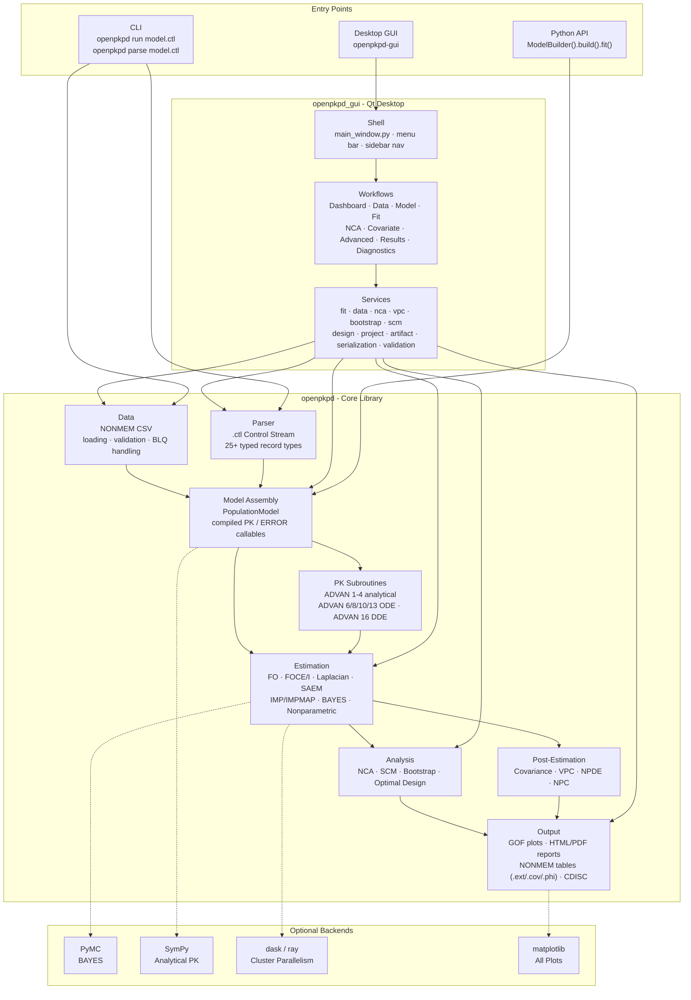
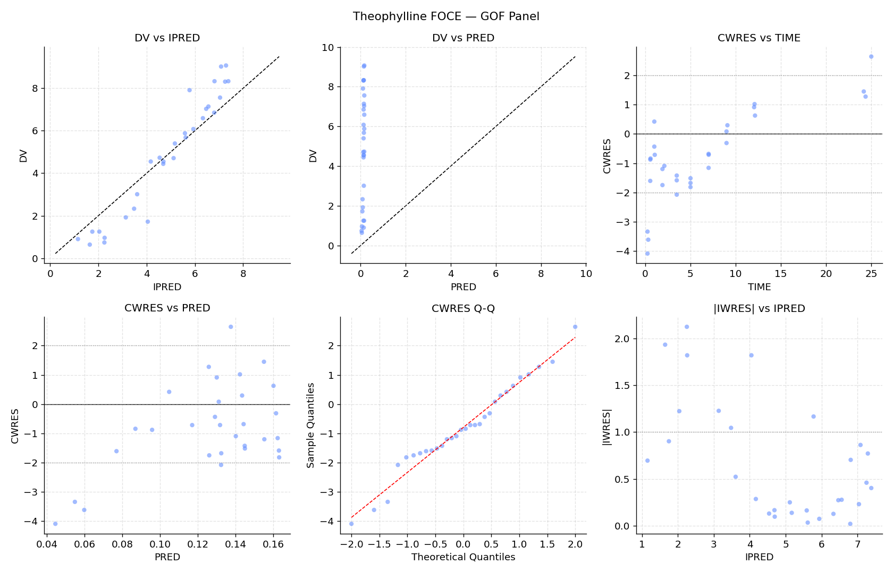

<p align="center">
  
</p>

# OpenPKPD

Open-source Python toolkit for population PK/PD analysis, with a native Python API,
NONMEM-style control-stream support, a CLI, and a Qt desktop GUI.


## Features

- **Estimation methods**: FO, FOCE/FOCEI, Laplacian, SAEM, IMP/IMPMAP, `BAYES`, and nonparametric estimation
- **PK subroutines**: analytical `ADVAN1–4`, `ADVAN11`, `ADVAN12`; numerical `ADVAN6/8/10/13`; DDE support via `ADVAN16`
- **NM-TRAN compiler**: `$PK`, `$DES`, and `$ERROR` blocks compiled to Python callables
- **Interfaces**: fluent `ModelBuilder`, NONMEM-style control streams, CLI, and a scenario-based Qt desktop GUI
- **Simulation and diagnostics**: replicate simulation, VPC/pcVPC, NPC, NPDE, GOF plots, residual plots, and ETA panels
- **Model families**: PK, PK/PD, TTE, count/categorical PD, TMDD, tumor growth, and advanced absorption models
- **Covariate workflows**: manual covariate coding, imputation helpers, and stepwise SCM
- **Data/output**: NONMEM-compatible `.lst/.ext/.phi/.cov/.cor` outputs, `$TABLE`, HTML reports, and NCA exports
- **Advanced integrations**: SBML import, sparse-sampling NCA, built-in multi-core parallelism for estimation and simulation
- **Examples and tests**: 30 example scripts plus extensive unit/integration/regression coverage

## Installation

```bash
pip install openpkpd                   # core library + CLI
pip install "openpkpd[plots]"          # + matplotlib plotting/diagnostics
pip install "openpkpd[gui]"            # + Qt desktop GUI + matplotlib plot output
pip install "openpkpd[bayes]"          # + PyMC backend for BAYES
pip install "openpkpd[notebooks]"      # + marimo notebook runtime
pip install "openpkpd[r]"             # + rpy2 R integration bridge
pip install "openpkpd[full]"           # + optimagic + sympy + matplotlib
```

With [uv](https://docs.astral.sh/uv/):

```bash
uv add openpkpd
uv add "openpkpd[plots]"
uv add "openpkpd[gui]"                 # GUI + plotting support
uv add "openpkpd[notebooks]"           # marimo notebooks
```

Optional extras:
- `pip install dask[distributed]` — distributed parallel execution
- `pip install ray` — Ray cluster execution
- `pip install mpi4py` — MPI backend
- `pip install python-libsbml` — SBML/QSP model import

`openpkpd[full]` does **not** include the GUI or Bayesian extras; install
`[gui]` and/or `[bayes]` separately as needed.

## Desktop GUI

Install the GUI extra, then launch the desktop application with:

```bash
openpkpd-gui
```

From a development checkout, these shortcuts are also supported:

```bash
uv run openpkpd-gui
just run-gui
```

The current GUI is organized around a **workspace / project / scenario** tree:

- selecting the **Workspace** root opens the workspace home page
- selecting a **Project** opens a project-details editor
- selecting a **Scenario** opens its **Dashboard** page
- scenario workflows branch into **Data**, **Model**, **Fit**, **NCA**, **Covariate**, **Advanced**, **Results**, and **Diagnostics**

The menu bar now carries the main shell actions:

- **File** for opening/saving `.opkpd` project snapshots
- **Workspace** for creating, duplicating, renaming, and snapshotting projects/scenarios
- **Navigate** for switching workflows
- **Inputs** for dataset import and NONMEM file loading
- **Results** for report/plot/diagnostic shortcuts
- **Settings** and **Help** for preferences and application info

Notable GUI pages and recent improvements:

- **Dashboard** summarizes scenario readiness, recommended next steps, recent activity, and available follow-on workflows
- **Model** supports two input modes selectable via radio buttons: **Builder** (form-based ADVAN/TRANS/parameter editor) and **Control stream** (plain-text `.ctl` editor).  When a control stream is opened, its `$DATA` CSV is loaded onto the **Data** screen automatically.  A dataset loaded on the **Data** screen takes priority over the control stream's `$DATA` path at fit time.  Bundled example control streams are listed in a searchable dropdown (visible in Control stream mode).  Every control group has a **?** button showing an informative tooltip.
- **Fit** shows a **"Fit in progress"** status while an estimation job is running, preventing ambiguity with "Ready to start fit".
- **Results** keeps common actions visible and places secondary actions under **More actions** menus.  CSV artifacts are now displayed as a rendered interactive table rather than raw text, and the page can jump directly to a strong sibling comparison scenario.
- **Plots** and **Diagnostics** provide focused artifact browsers and preview panes
- **Advanced** provides **VPC**, **Bootstrap**, **Design**, and **Artifacts** tabs, with secondary settings/log/preview panels hidden behind collapsible sections by default

## Architecture



## Quick start

```python
from openpkpd import ModelBuilder

built = (
    ModelBuilder()
    .problem("Theophylline 1-cmt oral FOCE")
    .data("theo.csv")
    .subroutines(advan=2, trans=2)
    .pk("""
        KA = THETA(1) * EXP(ETA(1))
        CL = THETA(2) * EXP(ETA(2))
        V  = THETA(3) * EXP(ETA(3))
    """)
    .error("Y = F * (1 + EPS(1))")
    .theta([(0.01, 1.5, 20),
            (0.001, 0.08, 5),
            (0.1, 30, 500)])
    .omega([0.5, 0.3, 0.3])
    .sigma(0.1)
    .estimation(method="FOCE", interaction=True, maxeval=9999)
    .covariance()
    .build()
)

result = built.fit()
print(result.summary())
print("OFV:", result.ofv)
print("THETA:", result.theta_final)
```

See `examples/` for 30 runnable examples covering FO/FOCE, control streams,
FOCEI optimizer controls, VPC, NCA, optimal design, Bayesian estimation,
SBML import, DDE, IOV, PBPK, and advanced PD.

The repository also ships a marimo notebook library under `notebooks/`; install
`openpkpd[notebooks]` to run them locally.

## Validation and benchmarking

The repository includes public cross-tool benchmarks under
`tests/external_validation/`, including:

- Monolix-backed theophylline SAEM checks
- nlmixr2-backed FOCEI checks for theophylline and warfarin
- PKNCA / Phoenix-style theophylline NCA checks
- WinNonlin-backed Indometh NCA checks from a published NonCompart validation paper
- PFIM-backed optimal-design checks and FOCEI diagnostic parity harnesses

Start with:

- `docs/user_guide/external_validation_benchmarks.md`
- `docs/user_guide/testing.md`
- `docs/user_guide/validation.md`


## Running a NONMEM control stream

```bash
openpkpd run model.ctl
openpkpd run model.ctl --method FOCE --verbose
openpkpd parse model.ctl --json
```

```python
from openpkpd.parser.control_stream import ControlStream
from openpkpd.cli.runner import run_model

cs = ControlStream.from_file("model.ctl")
result = run_model("model.ctl")
```

## HTML / PDF reports

```python
from openpkpd import export_html_report_to_pdf, write_pdf_report

result.to_html("report.html", params=built.params, title="My model")
result.to_pdf("report.pdf", params=built.params, title="My model")

write_pdf_report("report-copy.pdf", result, built.params, title="My model")
export_html_report_to_pdf("report.html", "report-from-html.pdf")
```

> PDF export uses the optional Qt-based GUI runtime. Install `openpkpd[gui]` to
> enable `result.to_pdf(...)`, `write_pdf_report(...)`, and
> `export_html_report_to_pdf(...)`.

## Diagnostic plots

```python
from openpkpd.plots.diagnostics import compute_diagnostics
from openpkpd.plots.gof import diagnostic_panel
from openpkpd.plots.pk import spaghetti_plot

diag_df = compute_diagnostics(built.population_model, result)

fig = diagnostic_panel(diag_df, title="My model — GOF")
fig.savefig("gof.png", dpi=150)
```



## Parallel estimation and simulation

FOCE/FOCEI, IMP, and `SimulationEngine` accept `n_parallel` to distribute work across CPU cores.  SAEM accepts `n_workers` directly on its constructor:

```python
from openpkpd.estimation import get_estimation_method

# FOCE inner loop across 8 processes (true multi-core via ProcessPoolExecutor)
method = get_estimation_method("FOCE", n_parallel=8)
result = method.estimate(pop_model, params)

# IMP uses ThreadPoolExecutor (numpy releases the GIL)
imp = get_estimation_method("IMP", n_parallel=8)

# SAEM: pass n_workers (not n_parallel) for thread-based E-step parallelism
from openpkpd.estimation.saem import SAEMMethod
saem = SAEMMethod(n_iter_phase1=200, n_iter_phase2=100, n_workers=8)

# Simulation replicates in parallel
from openpkpd.simulation.engine import SimulationEngine
sim = SimulationEngine(pop_model, result, seed=42, n_parallel=8)
vpc_data = sim.simulate(n_replicates=500)
```

`n_parallel=0` auto-selects the number of workers based on `os.cpu_count()`.
`n_parallel=1` (default) runs serially for reproducibility and debugging.

The **GUI Preferences** dialog exposes a **CPU cores** spinner that applies this setting globally to all fit and VPC jobs.

## Parallel bootstrap

```python
from openpkpd.parallel import get_backend

backend = get_backend(n_jobs=8)          # auto-selects Dask → Ray → multiprocessing
with backend:
    boot_results = backend.map(fit_replicate, bootstrap_datasets)
```

## SBML / QSP model import

```python
from openpkpd.io import load_sbml
from openpkpd.model.parameters import ParameterSet
from openpkpd.pk.ode.advan6 import ADVAN6

model = load_sbml("tumor_growth.xml")    # requires python-libsbml
advan = ADVAN6(n_compartments=model.n_compartments)
sol   = advan.solve(model.default_pk_params, dose_events, obs_times,
                    des_callable=model.des_callable)

# Fit SBML parameters
params = ParameterSet.from_specs(model.to_theta_specs(), [], [])
```

## Delay Differential Equations

```python
from openpkpd.pk.ode.dde import DDESubroutine

def my_dde(t, A, pk_params, theta, eta):
    hist = pk_params["_AHISTORY"]        # history function
    tau  = pk_params["TAU"]
    A_lag = hist(max(t - tau, 0.0))
    return [-(pk_params["CL"] / pk_params["V"]) * A_lag[0]]

dde = DDESubroutine(n_compartments=1)
sol = dde.solve({"CL": 2.0, "V": 10.0, "TAU": 0.5},
                dose_events, obs_times, des_callable=my_dde)
```

## Examples

| # | Topic |
|---|-------|
| 01 | Theophylline 1-cmt oral — FO |
| 02 | Warfarin FOCE with covariance step |
| 03 | Two-compartment IV bolus |
| 04 | Emax PD model |
| 05 | Indirect response model (IDR types 1–4) |
| 06 | From NONMEM control stream |
| 07 | Diagnostic plots |
| 08 | ODE transit absorption |
| 09 | Three-compartment ADVAN11/12 |
| 10 | Below-limit-of-quantification handling |
| 11 | Time-to-event survival model |
| 12 | Non-compartmental analysis (NCA) |
| 13 | Stepwise covariate modelling (SCM) |
| 14 | Simulation and VPC |
| 15 | Bayesian estimation via MAP and Laplace posterior approximation |
| 16 | Delay differential equation (DDE) model |
| 17 | SBML / QSP model import |
| 18 | Parallel bootstrap resampling |
| 19 | Count and categorical PD models |
| 20 | SAEM estimation with OFV convergence history |
| 21 | Laplacian estimation and prior augmentation |
| 22 | 5-organ PBPK model (lung, liver, kidney, gut, central) |
| 23 | Inter-occasion variability (IOV) modelling |
| 24 | Advanced PD models: effect compartment, turnover, TGI, placebo |

## Comparison with Other Tools

OpenPKPD is a pure-Python, open-source population PK/PD toolkit with native
NONMEM-style control-stream parsing and an in-process estimation/simulation stack.

### At a glance

| Feature | OpenPKPD | NONMEM 7.6 | Monolix 2024R1 | WinNonLin 8.7 | mrgsolve 1.5 | Pumas.jl 2.5 | Pharmpy 2.0 |
|---------|:--------:|:----------:|:--------------:|:-------------:|:------------:|:------------:|:-----------:|
| Open source | ✓ | — | — | — | ✓ | partial | ✓ |
| Pure Python / no install fee | ✓ | — | — | — | — | — | partial |
| NONMEM .ctl compatibility | ✓ | — | — | — | — | — | ✓ |
| FO / FOCE / FOCEI | ✓ | ✓ | ✓ | ✓ | — | ✓ | via NONMEM |
| SAEM | ✓ | ✓ | ✓ | — | — | ✓ | via NONMEM |
| Full Bayesian (NUTS/MCMC) | partial | ✓ | — | — | — | ✓ | — |
| Analytical PK (ADVAN1–4,11,12) | ✓ | ✓ | ✓ | ✓ | ✓ | ✓ | via NONMEM |
| ODE PK (ADVAN6/8/10) | ✓ | ✓ | ✓ | — | ✓ | ✓ | via NONMEM |
| Delay differential equations | ✓ | ✓ | — | — | — | ✓ | via NONMEM |
| PBPK / large ODE systems | ✓ | — | — | — | ✓ | ✓ | via NONMEM |
| NONMEM-compatible output (.lst/.ext/.phi/.cov) | ✓ | ✓ | — | — | — | — | ✓ |
| HTML report | ✓ | — | ✓ | ✓ | — | ✓ | ✓ |
| NCA (AUC, Cmax, t½, BE) | ✓ | — | ✓ | ✓ | — | ✓ | ✓ |
| Sparse sampling NCA | ✓ | — | ✓ | ✓ | — | ✓ | — |
| CDISC PP / ADPPK output | partial | — | — | ✓ | — | — | — |
| Missing covariate imputation | ✓ | ✓ | ✓ | ✓ | — | ✓ | ✓ |
| BLQ handling M1/M3/M4 | ✓ | ✓ | ✓ | ✓ | — | ✓ | via NONMEM |
| IOV (inter-occasion variability) | ✓ | ✓ | ✓ | ✓ | — | ✓ | ✓ |
| Stepwise covariate modelling (SCM) | partial | via PsN | ✓ | — | — | ✓ | ✓ |
| VPC / bootstrap | ✓ | via PsN | ✓ | ✓ | — | ✓ | ✓ |
| SBML / QSP model import | ✓ | — | — | — | — | — | — |
| Parallel execution (multi-core / Dask / Ray) | ✓ | ✓ | ✓ | — | ✓ | ✓ | ✓ |
| GUI | ✓ | — | ✓ | ✓ | — | partial | — |
| R integration | ✓ | via PsN | — | ✓ | ✓ | — | ✓ |

**Legend:** ✓ = fully supported; partial = partially supported; via NONMEM = supported through NONMEM as a required backend; — = not available.

> **Note on Pharmpy**: Pharmpy is a model manipulation and workflow library (Uppsala University). It reads, writes, and transforms NONMEM/nlmixr2 models and orchestrates tools such as SCM, VPC, and bootstrap, but delegates all parameter estimation to an external engine (NONMEM or nlmixr2). Rows marked "via NONMEM" require a separate NONMEM licence.

### Where OpenPKPD leads

- **Native NONMEM-style control-stream parsing plus a built-in engine**: inspect, run, and translate `.ctl` workflows without depending on a commercial backend.
- **SBML/QSP import**: load systems-biology models from BioModels / libSBML directly into the estimation pipeline.
- **Delay differential equations**: DDESubroutine (ADVAN16) with history-interpolation — unique among Python tools.
- **NONMEM-format output**: `.lst`, `.ext`, `.phi`, `.cov`, `.cor` files readable by Xpose, PsN, and Certara tools.
- **CDISC output**: PP domain (NCA) and ADPPK-style CSV for regulatory data exchange.
- **Sparse sampling NCA**: model-informed profile reconstruction for 2–5-sample-per-subject designs.
- **Broad feature coverage in one repository**: estimation, NCA, simulation, bootstrap, SCM, reporting, and a desktop GUI live together in the same codebase.

### Where OpenPKPD trails

- **Speed**: Pure-Python inner loops are slower than compiled C++ (mrgsolve) or Julia (Pumas) for large simulations.
- **SAEM convergence**: functional but less mature than specialized SAEM software; Monolix and Pumas have deeper convergence diagnostics and tuning options.
- **GUI scope**: OpenPKPD ships a working desktop GUI, but it is narrower and less mature than the commercial GUI-first workflows in WinNonLin and Monolix.
- **Regulatory validation**: NONMEM and WinNonLin are GxP-validated commercial products; OpenPKPD is research-grade.

Full feature comparison: [`docs/user_guide/comparison.md`](docs/user_guide/comparison.md)

## Development

```bash
git clone https://gitlab.com/breisfeld/OpenPKPD.git
cd openpkpd
uv sync --all-extras
uv run pytest -q
```

For common source-checkout workflows, the repository also includes a
cross-platform `justfile` that selects the needed `uv` extras automatically:

```bash
just run-tests-unit
just lint
just build-docs-html
just install-hooks
```

See `docs/contributing.md` for the fuller contributor workflow.

**Notes**: Much of the code in the code base was created by Claude AI under
careful guidance and review. As with all PRs, those using AI will be considered
if they have been carefully vetted and tested by the human submitter.


## Selected references

A complete, annotated bibliography is in
[`docs/user_guide/citations.md`](docs/user_guide/citations.md).
Key primary sources for the implemented algorithms are listed below.

**Estimation**

- Sheiner LB, Beal SL (1980, 1983). Evaluation of methods for estimating
  population pharmacokinetic parameters. *J Pharmacokinet Biopharm*
  **8**:553–571; **11**:303–319. *(FO / FOCE foundation.)*
- Delyon B, Lavielle M, Moulines E (1999). Convergence of a stochastic
  approximation version of the EM algorithm. *Ann Stat* **27**:94–128.
  *(SAEM.)*
- Kuhn E, Lavielle M (2004). Coupling a stochastic approximation version of EM
  with an MCMC procedure. *ESAIM Probab Stat* **8**:115–131. *(SAEM
  Rao–Blackwellisation.)*
- Mallet A (1986). A maximum likelihood estimation method for random coefficient
  regression models. *Biometrika* **73**:645–656. *(Nonparametric NPML.)*
- Byrd RH, Lu P, Nocedal J, Zhu C (1995). A limited memory algorithm for bound
  constrained optimization. *SIAM J Sci Comput* **16**:1190–1208. *(L-BFGS-B
  outer optimizer.)*

**Covariance step**

- White H (1982). Maximum likelihood estimation of misspecified models.
  *Econometrica* **50**:1–25. *(Sandwich R⁻¹SR⁻¹ estimator.)*

**PK/PD models**

- Savic RM, Jonker DM, Kerbusch T, Karlsson MO (2007). Implementation of a
  transit compartment model for describing drug absorption. *J Pharmacokinet
  Pharmacodyn* **34**:711–726.
- Sheiner LB, Stanski DR, Vozeh S, Miller RD, Ham J (1979). Simultaneous
  modeling of pharmacokinetics and pharmacodynamics. *Clin Pharmacol Ther*
  **25**:358–371. *(Effect compartment / link model.)*
- Dayneka NL, Garg V, Jusko WJ (1993). Comparison of four basic models of
  indirect pharmacodynamic responses. *J Pharmacokinet Biopharm*
  **21**:457–478. *(IDR types I–IV.)*
- Mager DE, Jusko WJ (2001). General pharmacokinetic model for drugs exhibiting
  target-mediated drug disposition. *J Pharmacokinet Pharmacodyn*
  **28**:507–532. *(TMDD full model.)*
- Simeoni M, et al. (2004). Predictive pharmacokinetic-pharmacodynamic modeling
  of tumor growth kinetics. *Cancer Res* **64**:1094–1101.

**NCA and diagnostics**

- Schuirmann DJ (1987). A comparison of the two one-sided tests procedure for
  assessing bioequivalence. *J Pharmacokinet Biopharm* **15**:657–680.
- Karlsson MO, Holford N (2008). A tutorial on visual predictive checks.
  PAGE 17, Abstr 1434.
- Brendel K, Comets E, Laffont C, Laveille C, Mentré F (2006). Metrics for
  external model evaluation. *Pharm Res* **23**:2036–2049. *(NPDE.)*

**Covariate modelling and optimal design**

- Jonsson EN, Karlsson MO (1998). Automated covariate model building within
  NONMEM. *Pharm Res* **15**:1463–1468. *(SCM.)*
- Mentré F, Mallet A, Baccar D (1997). Optimal design in random-effects
  regression models. *Biometrika* **84**:429–442. *(Population FIM / PFIM.)*


## Licence

AGPLv3 — see [LICENSE](LICENSE) for details.
