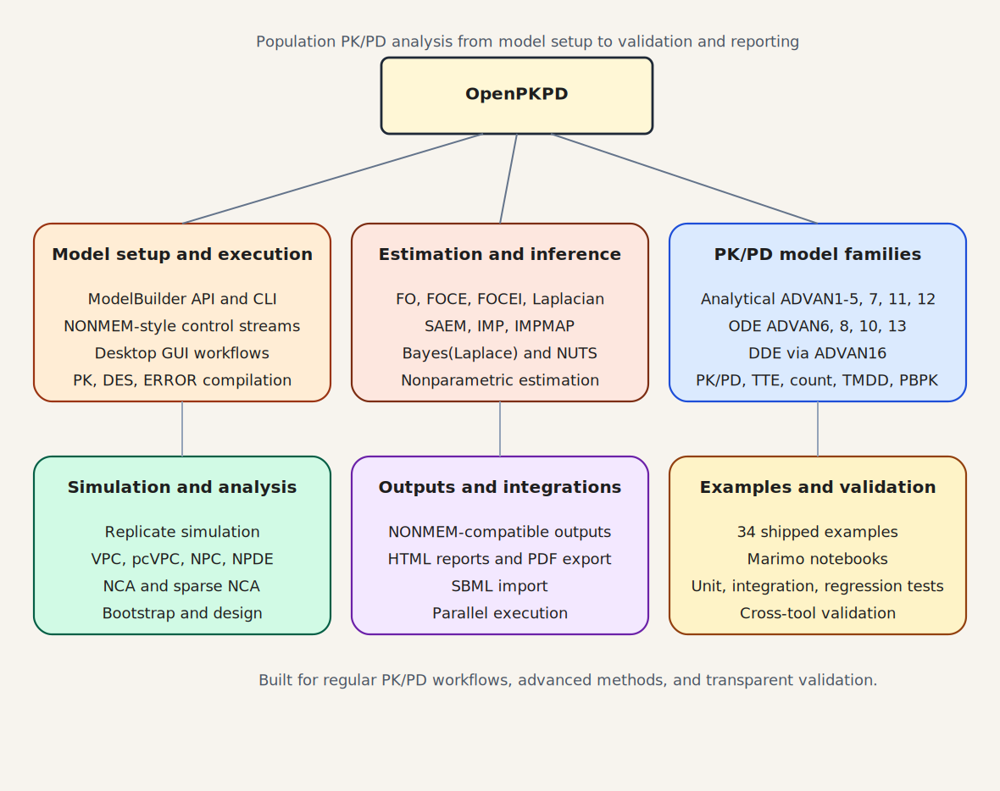

<p align="center">
  
</p>

# OpenPKPD

Open-source Python toolkit for population PK/PD analysis, with a native Python API,
NONMEM-style control-stream support, a CLI, and a Qt desktop GUI.



## Contents

- [Features](#features)
- [Installation](#installation)
- [Desktop GUI](#desktop-gui)
- [Quick start](#quick-start)
- [Validation and benchmarking](#validation-and-benchmarking)
- [Running a NONMEM control stream](#running-a-nonmem-control-stream)
- [HTML / PDF reports](#html--pdf-reports)
- [Diagnostic plots](#diagnostic-plots)
- [Parallel estimation and simulation](#parallel-estimation-and-simulation)
- [Parallel bootstrap](#parallel-bootstrap)
- [SBML / QSP model import](#sbml--qsp-model-import)
- [Delay Differential Equations](#delay-differential-equations)
- [Examples](#examples)
- [Comparison with Other Tools](#comparison-with-other-tools)
- [Development](#development)
- [Selected references](#selected-references)
- [Licence](#licence)


## Features

- Python API, NONMEM-style control streams, CLI, and desktop GUI on the same estimation engine
- FO/FOCE/FOCEI/Laplacian plus SAEM, IMP/IMPMAP, `BAYES(Laplace)`, NUTS, and nonparametric estimation
- analytical ADVAN routes, numerical ODE solvers, DDE support, and broad PK/PD model families
- simulation, VPC/pcVPC, NPC, NPDE, NCA, sparse-sampling NCA, bootstrap, and optimal design
- NONMEM-compatible outputs, HTML/PDF reporting, SBML import, and parallel execution hooks
- 34 shipped examples, marimo notebooks, and extensive automated validation against exact references and external tools

## Installation

```bash
pip install openpkpd                   # core library + CLI + SymPy analytical path
pip install "openpkpd[plots]"          # + matplotlib plotting/diagnostics
pip install "openpkpd[gui]"            # + Qt desktop GUI + matplotlib plot output
pip install "openpkpd[jit]"            # + Numba JIT (10–30× ODE speedup)
pip install "openpkpd[bayes]"          # + PyMC backend for BAYES
pip install "openpkpd[notebooks]"      # + marimo notebook runtime
pip install "openpkpd[r]"             # + optional rpy2 Python-R bridge
pip install "openpkpd[full]"           # + optimagic + matplotlib
```

With [uv](https://docs.astral.sh/uv/):

```bash
uv add openpkpd
uv add "openpkpd[plots]"
uv add "openpkpd[gui]"                 # GUI + plotting support
uv add "openpkpd[jit]"                 # Numba JIT — 10–30× ODE speedup
uv add "openpkpd[notebooks]"           # marimo notebooks
```

Optional extras:
- `pip install dask[distributed]` — distributed parallel execution
- `pip install ray` — Ray cluster execution
- `pip install mpi4py` — MPI backend
- `pip install python-libsbml` — SBML/QSP model import

`openpkpd[full]` does **not** include the GUI or Bayesian extras; install
`[gui]` and/or `[bayes]` separately as needed. SymPy is part of the core
dependency set because the symbolic analytical-kernel path is now treated as a
first-class tested route.

The detailed “which extra should I install, and why?” guidance lives in
[docs/getting_started/installation.md](/home/breisfel/Documents/projects/openpkpd/docs/getting_started/installation.md).

## Desktop GUI

Install the GUI extra (Qt/PySide6 + matplotlib), then launch the desktop
application with:

```bash
pip install "openpkpd[gui]"   # one-time: installs PySide6 + matplotlib
openpkpd-gui                   # launch the desktop application
```

From a development checkout, these shortcuts are also supported:

```bash
uv run openpkpd-gui
just run-gui
```

The current GUI is organized around a **workspace / project / scenario** tree:

- selecting the **Workspace** root opens the workspace home page
- selecting a **Project** opens a project-details editor
- selecting a **Scenario** opens its **Dashboard** page
- scenario workflows branch into **Data**, **Model**, **Fit**, **NCA**, **Covariate**, **Advanced**, **Results**, and **Diagnostics**

The menu bar now carries the main shell actions:

- **File** for opening/saving `.opkpd` project snapshots
- **Workspace** for creating, duplicating, renaming, and snapshotting projects/scenarios
- **Navigate** for switching workflows
- **Inputs** for dataset import and NONMEM file loading
- **Results** for report/plot/diagnostic shortcuts
- **Settings** and **Help** for preferences and application info

Notable GUI pages and recent improvements:

- **Dashboard** summarizes scenario readiness, recommended next steps, recent activity, and available follow-on workflows
- **Model** supports two input modes selectable via radio buttons: **Builder** (form-based ADVAN/TRANS/parameter editor) and **Control stream** (plain-text `.ctl` editor).  When a control stream is opened, its `$DATA` CSV is loaded onto the **Data** screen automatically.  A dataset loaded on the **Data** screen takes priority over the control stream's `$DATA` path at fit time.  Bundled example control streams are listed in a searchable dropdown (visible in Control stream mode).  Every control group has a **?** button showing an informative tooltip.
- **Fit** shows a **"Fit in progress"** status while an estimation job is running, preventing ambiguity with "Ready to start fit".
- **Results** keeps common actions visible and places secondary actions under **More actions** menus.  CSV artifacts are now displayed as a rendered interactive table rather than raw text, and the page can jump directly to a strong sibling comparison scenario.  Bayesian review actions are shown when the current run produced Bayesian posterior artifacts.
- **Plots** and **Diagnostics** provide focused artifact browsers and preview panes
- **Advanced** provides **VPC**, **Bootstrap**, **Design**, and **Artifacts** tabs, with secondary settings/log/preview panels hidden behind collapsible sections by default.  The current **Design** tab fronts the implemented PFIM path, whose support boundary is intentionally narrower than the broadest residual-error structures advertised by some external tools; see the validation matrix and optimal-design example docs for the current envelope.

## Quick start

```python
from openpkpd import ModelBuilder

built = (
    ModelBuilder()
    .problem("Theophylline 1-cmt oral FOCE")
    .data("theo.csv")
    .subroutines(advan=2, trans=2)
    .pk("""
        KA = THETA(1) * EXP(ETA(1))
        CL = THETA(2) * EXP(ETA(2))
        V  = THETA(3) * EXP(ETA(3))
    """)
    .error("Y = F * (1 + EPS(1))")
    .theta([(0.01, 1.5, 20),
            (0.001, 0.08, 5),
            (0.1, 30, 500)])
    .omega([0.5, 0.3, 0.3])
    .sigma(0.1)
    .estimation(method="FOCE", interaction=True, maxeval=9999)
    .covariance()
    .build()
)

result = built.fit()
print(result.summary())
print("OFV:", result.ofv)
print("THETA:", result.theta_final)
```

See `examples/` for 34 runnable examples covering FO/FOCE, control streams,
FOCEI optimizer controls, VPC, NCA, optimal design, Bayesian estimation,
SBML import, DDE, IOV, PBPK, advanced PD, IMP/IMPMAP warm-start comparison,
nonparametric support-point estimation, TMDD, multidose steady-state NCA, and
phenobarbital population PK. The Sphinx example section documents a curated
subset of those scripts in more detail; shipped examples outnumber annotated
worked-example pages.

The repository also ships a marimo notebook library under `notebooks/`; install
`openpkpd[notebooks]` to run them locally.

## Validation and benchmarking

The repository includes public cross-tool benchmarks under
`tests/external_validation/`, including:

- Monolix-backed theophylline SAEM checks
- nlmixr2-backed FOCEI checks for theophylline and warfarin
- nlmixr2-backed SAEM checks for warfarin PK (32 subjects)
- Grasela & Donn (1985) SAEM checks for neonatal phenobarbital (59 subjects)
- nlmixr2 FOCEI basin anchor for warfarin BAYES(Laplace)
- NONMEM 402 empirical BAYES(Laplace) benchmark
- Pharmpy `pheno` and theophylline nonparametric empirical benchmarks
- PKNCA / Phoenix-style theophylline NCA checks
- WinNonlin-backed Indometh NCA checks from a published NonCompart validation paper
- PFIM-backed optimal-design checks and FOCEI diagnostic parity harnesses

Start with:

- `docs/user_guide/validation_matrix.md`
- `docs/user_guide/external_validation_benchmarks.md`
- `docs/user_guide/testing.md`
- `docs/user_guide/validation.md`


## Running a NONMEM control stream

```bash
openpkpd run model.ctl
openpkpd run model.ctl --method FOCE --verbose
openpkpd parse model.ctl --json
```

```python
from openpkpd.parser.control_stream import ControlStream
from openpkpd.cli.runner import run_model

cs = ControlStream.from_file("model.ctl")
result = run_model("model.ctl")
```

## HTML / PDF reports

```python
from openpkpd import export_html_report_to_pdf, write_pdf_report

result.to_html("report.html", params=built.params, title="My model")
result.to_pdf("report.pdf", params=built.params, title="My model")

write_pdf_report("report-copy.pdf", result, built.params, title="My model")
export_html_report_to_pdf("report.html", "report-from-html.pdf")
```

> PDF export uses the optional Qt-based GUI runtime. Install `openpkpd[gui]` to
> enable `result.to_pdf(...)`, `write_pdf_report(...)`, and
> `export_html_report_to_pdf(...)`.

## Diagnostic plots

```python
from openpkpd.plots.diagnostics import compute_diagnostics
from openpkpd.plots.gof import diagnostic_panel
from openpkpd.plots.pk import spaghetti_plot

diag_df = compute_diagnostics(built.population_model, result)

fig = diagnostic_panel(diag_df, title="My model — GOF")
fig.savefig("gof.png", dpi=150)
```


## Parallel estimation and simulation

FOCE/FOCEI, IMP, and `SimulationEngine` accept `n_parallel` to distribute work across CPU cores.  SAEM accepts `n_workers` directly on its constructor:

```python
from openpkpd.estimation import get_estimation_method

# FOCE inner loop across 8 processes (true multi-core via ProcessPoolExecutor)
method = get_estimation_method("FOCE", n_parallel=8)
result = method.estimate(pop_model, params)

# IMP uses ThreadPoolExecutor (numpy releases the GIL)
imp = get_estimation_method("IMP", n_parallel=8)

# SAEM: pass n_workers (not n_parallel) for thread-based E-step parallelism
from openpkpd.estimation.saem import SAEMMethod
saem = SAEMMethod(n_iter_phase1=200, n_iter_phase2=100, n_workers=8)

# Simulation replicates in parallel
from openpkpd.simulation.engine import SimulationEngine
sim = SimulationEngine(pop_model, result, seed=42, n_parallel=8)
vpc_data = sim.simulate(n_replicates=500)
```

`n_parallel=0` auto-selects the number of workers based on `os.cpu_count()`.
`n_parallel=1` (default) runs serially for reproducibility and debugging.

The **GUI Preferences** dialog exposes a **CPU cores** spinner that applies this setting globally to all fit and VPC jobs.

## Parallel bootstrap

```python
from openpkpd.parallel import get_backend

backend = get_backend(n_jobs=8)          # auto-selects Dask → Ray → multiprocessing
with backend:
    boot_results = backend.map(fit_replicate, bootstrap_datasets)
```

## SBML / QSP model import

```python
from openpkpd.io import load_sbml
from openpkpd.model.parameters import ParameterSet
from openpkpd.pk.ode.advan6 import ADVAN6

model = load_sbml("tumor_growth.xml")    # requires python-libsbml
advan = ADVAN6(n_compartments=model.n_compartments)
sol   = advan.solve(model.default_pk_params, dose_events, obs_times,
                    des_callable=model.des_callable)

# Fit SBML parameters
params = ParameterSet.from_specs(model.to_theta_specs(), [], [])
```

## Delay Differential Equations

```python
from openpkpd.pk.ode.dde import DDESubroutine

def my_dde(t, A, pk_params, theta, eta):
    hist = pk_params["_AHISTORY"]        # history function
    tau  = pk_params["TAU"]
    A_lag = hist(max(t - tau, 0.0))
    return [-(pk_params["CL"] / pk_params["V"]) * A_lag[0]]

dde = DDESubroutine(n_compartments=1)
sol = dde.solve({"CL": 2.0, "V": 10.0, "TAU": 0.5},
                dose_events, obs_times, des_callable=my_dde)
```

## Examples

| # | Topic | # | Topic |
|---|-------|---|-------|
| 01 | Theophylline 1-cmt oral — FO | 18 | Parallel bootstrap resampling |
| 02 | Warfarin FOCE with covariance step | 19 | Count and categorical PD models |
| 03 | Two-compartment IV bolus | 20 | SAEM estimation with OFV convergence history |
| 04 | Emax PD model | 21 | Laplacian estimation and prior augmentation |
| 05 | Indirect response model (IDR types 1–4) | 22 | 5-organ PBPK model (lung, liver, kidney, gut, central) |
| 06 | From NONMEM control stream | 23 | Inter-occasion variability (IOV) modelling |
| 07 | Diagnostic plots | 24 | Advanced PD models: effect compartment, turnover, TGI, placebo |
| 08 | ODE transit absorption | 25 | FOCEI optimizer controls: L-BFGS-B, Powell fallback, multi-start, retry logic |
| 09 | Three-compartment ADVAN11/12 | 26 | Control-stream optimizer extension inspection |
| 10 | Below-limit-of-quantification handling | 27 | Phenobarbital neonatal population PK — weight-based allometric scaling |
| 11 | Time-to-event survival model | 28 | Indometh NCA (Phoenix WinNonlin reference) |
| 12 | Non-compartmental analysis (NCA) | 29 | Optimal design (PFIM-backed sampling-time optimization) |
| 13 | Stepwise covariate modelling (SCM) | 30 | Four-compartment ADVAN5 (micro-rate) model |
| 14 | Simulation and VPC | 31 | IMP vs IMPMAP warm-start comparison on warfarin PK |
| 15 | Bayesian estimation via MAP and Laplace posterior approximation | 32 | Nonparametric support-point estimation on phenobarbital |
| 16 | Delay differential equation (DDE) model | 33 | TMDD / QSSA / Michaelis-Menten approximation comparison |
| 17 | SBML / QSP model import | 34 | Multi-dose steady-state NCA |

## Comparison with Other Tools

OpenPKPD is a pure-Python, open-source population PK/PD toolkit with native
NONMEM-style control-stream parsing and an in-process estimation/simulation stack.

### At a glance

| Feature | OpenPKPD | NONMEM 7.6 | Monolix 2024R1 | WinNonLin 8.7 | mrgsolve 1.5 | Pumas.jl 2.5 | Pharmpy 2.0 |
|---------|:--------:|:----------:|:--------------:|:-------------:|:------------:|:------------:|:-----------:|
| Open source | ✓ | — | — | — | ✓ | partial | ✓ |
| Pure Python / no install fee | ✓ | — | — | — | — | — | partial |
| NONMEM .ctl compatibility | ✓ | — | — | — | — | — | ✓ |
| FO / FOCE / FOCEI | ✓ | ✓ | ✓ | ✓ | — | ✓ | via NONMEM |
| SAEM | partial | ✓ | ✓ | — | — | ✓ | via NONMEM |
| Full Bayesian (NUTS/MCMC) | partial | ✓ | — | — | — | ✓ | — |
| Analytical PK (ADVAN1–4,11,12) | ✓ | ✓ | ✓ | ✓ | ✓ | ✓ | via NONMEM |
| ODE PK (ADVAN6/8/10) | ✓ | ✓ | ✓ | — | ✓ | ✓ | via NONMEM |
| Delay differential equations | ✓ | ✓ | — | — | — | ✓ | via NONMEM |
| PBPK / large ODE systems | ✓ | — | — | — | ✓ | ✓ | via NONMEM |
| NONMEM-compatible output (.lst/.ext/.phi/.cov) | ✓ | ✓ | — | — | — | — | ✓ |
| HTML report | ✓ | — | ✓ | ✓ | — | ✓ | ✓ |
| NCA (AUC, Cmax, t½, BE) | ✓ | — | ✓ | ✓ | — | ✓ | ✓ |
| Sparse sampling NCA | ✓ | — | ✓ | ✓ | — | ✓ | — |
| CDISC PP / ADPPK output | partial | — | — | ✓ | — | — | — |
| Missing covariate imputation | ✓ | ✓ | ✓ | ✓ | — | ✓ | ✓ |
| BLQ handling M1/M3/M4 | ✓ | ✓ | ✓ | ✓ | — | ✓ | via NONMEM |
| IOV (inter-occasion variability) | ✓ | ✓ | ✓ | ✓ | — | ✓ | ✓ |
| Stepwise covariate modelling (SCM) | partial | via PsN | ✓ | — | — | ✓ | ✓ |
| VPC / bootstrap | ✓ | via PsN | ✓ | ✓ | — | ✓ | ✓ |
| SBML / QSP model import | ✓ | — | — | — | — | — | — |
| Parallel execution (multi-core / Dask / Ray) | ✓ | ✓ | ✓ | — | ✓ | ✓ | ✓ |
| GUI | partial | — | ✓ | ✓ | — | partial | — |
| R integration | ✓ | via PsN | — | ✓ | ✓ | — | ✓ |

**Legend:** ✓ = primary / broadly validated support; partial = real but narrower, selectively benchmarked, or less mature than the strongest alternatives; via NONMEM = supported through NONMEM as a required backend; — = not available.

> **Note on Pharmpy**: Pharmpy is a model manipulation and workflow library (Uppsala University). It reads, writes, and transforms NONMEM/nlmixr2 models and orchestrates tools such as SCM, VPC, and bootstrap, but delegates all parameter estimation to an external engine (NONMEM or nlmixr2). Rows marked "via NONMEM" require a separate NONMEM licence.

For the method-by-method support classification behind these labels, see
[`docs/user_guide/validation_matrix.md`](docs/user_guide/validation_matrix.md).

### Where OpenPKPD leads

- **Native NONMEM-style control-stream parsing plus a built-in engine**: inspect, run, and translate `.ctl` workflows without depending on a commercial backend.
- **SBML/QSP import**: load systems-biology models from BioModels / libSBML directly into the estimation pipeline.
- **Delay differential equations**: DDESubroutine (ADVAN16) with history-interpolation — unique among Python tools.
- **NONMEM-format output**: `.lst`, `.ext`, `.phi`, `.cov`, `.cor` files readable by Xpose, PsN, and Certara tools.
- **CDISC output**: PP domain (NCA) and ADPPK-style CSV for regulatory data exchange.
- **Sparse sampling NCA**: model-informed profile reconstruction for 2–5-sample-per-subject designs.
- **Broad feature coverage in one repository**: estimation, NCA, simulation, bootstrap, SCM, reporting, and a desktop GUI live together in the same codebase.

### Where OpenPKPD trails

- **Speed**: Pure-Python inner loops are slower than compiled C++ (mrgsolve) or Julia (Pumas) for large simulations. The optional `openpkpd[jit]` extra closes much of this gap for ODE models (10–30× speedup via Numba LLC tier), but estimation outer loops and analytical ADVAN subroutines remain Python-speed.
- **SAEM convergence**: functional but less mature than specialized SAEM software; Monolix and Pumas have deeper convergence diagnostics and tuning options.
- **Advanced-estimator breadth**: SAEM, IMP/IMPMAP, BAYES(Laplace), native NUTS, and nonparametric estimation are real surfaces, but most still have narrower external-validation envelopes than FO/FOCEI.
- **GUI scope**: OpenPKPD ships a working desktop GUI, but it is narrower and less mature than the commercial GUI-first workflows in WinNonLin and Monolix.
- **Regulatory validation**: NONMEM and WinNonLin are GxP-validated commercial products; OpenPKPD is research-grade.

Full feature comparison: [`docs/user_guide/comparison.md`](docs/user_guide/comparison.md)

## Development

```bash
git clone https://github.com/breisfeld/OpenPKPD.git
cd openpkpd
uv sync --all-extras
uv run pytest -q
```

If you specifically want the symbolic analytical-kernel path active in a source
checkout, use:

```bash
uv sync --extra dev --extra symbolic
just prewarm-symbolic-caches
```

For common source-checkout workflows, the repository also includes a
cross-platform `justfile` that selects the needed `uv` extras automatically:

```bash
just run-tests-unit
just lint
just build-docs-html
just install-hooks
```

See `docs/contributing.md` for the fuller contributor workflow.

**Notes**: Much of the code in the code base was created by Claude AI under
careful guidance and review. As with all PRs, those using AI will be considered
if they have been carefully vetted and tested by the human submitter.


## Selected references

A complete, annotated bibliography is in
[`docs/user_guide/citations.md`](docs/user_guide/citations.md).
Key primary sources for the implemented algorithms are listed below.

**Estimation**

- Sheiner LB, Beal SL (1980, 1983). Evaluation of methods for estimating
  population pharmacokinetic parameters. *J Pharmacokinet Biopharm*
  **8**:553–571; **11**:303–319. *(FO / FOCE foundation.)*
- Delyon B, Lavielle M, Moulines E (1999). Convergence of a stochastic
  approximation version of the EM algorithm. *Ann Stat* **27**:94–128.
  *(SAEM.)*
- Kuhn E, Lavielle M (2004). Coupling a stochastic approximation version of EM
  with an MCMC procedure. *ESAIM Probab Stat* **8**:115–131. *(SAEM
  Rao–Blackwellisation.)*
- Mallet A (1986). A maximum likelihood estimation method for random coefficient
  regression models. *Biometrika* **73**:645–656. *(Nonparametric NPML.)*
- Byrd RH, Lu P, Nocedal J, Zhu C (1995). A limited memory algorithm for bound
  constrained optimization. *SIAM J Sci Comput* **16**:1190–1208. *(L-BFGS-B
  outer optimizer.)*

**Covariance step**

- White H (1982). Maximum likelihood estimation of misspecified models.
  *Econometrica* **50**:1–25. *(Sandwich R⁻¹SR⁻¹ estimator.)*

**PK/PD models**

- Savic RM, Jonker DM, Kerbusch T, Karlsson MO (2007). Implementation of a
  transit compartment model for describing drug absorption. *J Pharmacokinet
  Pharmacodyn* **34**:711–726.
- Sheiner LB, Stanski DR, Vozeh S, Miller RD, Ham J (1979). Simultaneous
  modeling of pharmacokinetics and pharmacodynamics. *Clin Pharmacol Ther*
  **25**:358–371. *(Effect compartment / link model.)*
- Dayneka NL, Garg V, Jusko WJ (1993). Comparison of four basic models of
  indirect pharmacodynamic responses. *J Pharmacokinet Biopharm*
  **21**:457–478. *(IDR types I–IV.)*
- Mager DE, Jusko WJ (2001). General pharmacokinetic model for drugs exhibiting
  target-mediated drug disposition. *J Pharmacokinet Pharmacodyn*
  **28**:507–532. *(TMDD full model.)*
- Simeoni M, et al. (2004). Predictive pharmacokinetic-pharmacodynamic modeling
  of tumor growth kinetics. *Cancer Res* **64**:1094–1101.

**NCA and diagnostics**

- Schuirmann DJ (1987). A comparison of the two one-sided tests procedure for
  assessing bioequivalence. *J Pharmacokinet Biopharm* **15**:657–680.
- Karlsson MO, Holford N (2008). A tutorial on visual predictive checks.
  PAGE 17, Abstr 1434.
- Brendel K, Comets E, Laffont C, Laveille C, Mentré F (2006). Metrics for
  external model evaluation. *Pharm Res* **23**:2036–2049. *(NPDE.)*

**Covariate modelling and optimal design**

- Jonsson EN, Karlsson MO (1998). Automated covariate model building within
  NONMEM. *Pharm Res* **15**:1463–1468. *(SCM.)*
- Mentré F, Mallet A, Baccar D (1997). Optimal design in random-effects
  regression models. *Biometrika* **84**:429–442. *(Population FIM / PFIM.)*


## Licence

AGPLv3 — see [LICENSE](LICENSE) for details.
