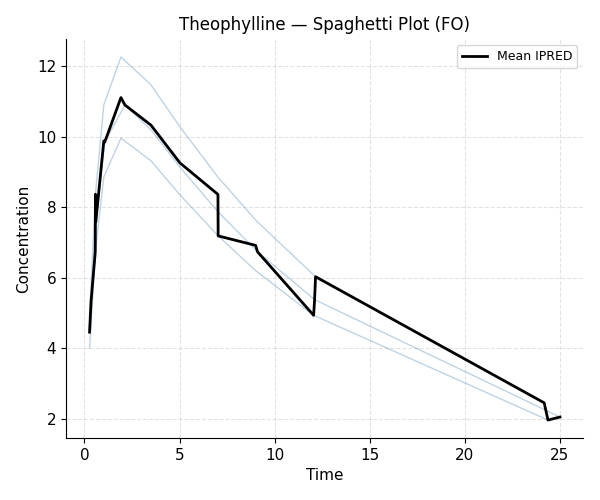
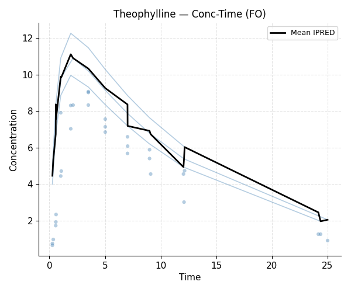

# Example 1 — Theophylline (FO)

**Model:** 1-compartment oral, First Order estimation
**Script:** `examples/01_theophylline_fo.py`

This example fits the classic theophylline dataset using the simplest
estimation method (FO) as a quick sanity check before moving to FOCE.

## Model

```python
from openpkpd import ModelBuilder

result = (
    ModelBuilder()
    .problem("Theophylline 1-cmt oral FO")
    .data("theo.csv")
    .subroutines(advan=2, trans=2)
    .pk("""
        KA = THETA(1) * EXP(ETA(1))
        CL = THETA(2) * EXP(ETA(2))
        V  = THETA(3) * EXP(ETA(3))
    """)
    .error("Y = F * (1 + EPS(1))")
    .theta([(0.01, 1.5, 20),
            (0.001, 0.08, 5),
            (0.1, 30, 500)])
    .omega([0.5, 0.3, 0.3])
    .sigma(0.1)
    .estimation(method="FO", maxeval=500)
    .build()
    .fit()
)

print(result.summary())
```

## Output

```{literalinclude} ../_static/examples/01_output.txt
:language: text
```

## Figures




## Notes

- FO post-hoc ETAs are all zero (no inner optimisation loop).
- Use {doc}`02_warfarin_foce` to compare FOCE results on a similar dataset.
- CWRES ≈ WRES for FO (no conditional residuals).
