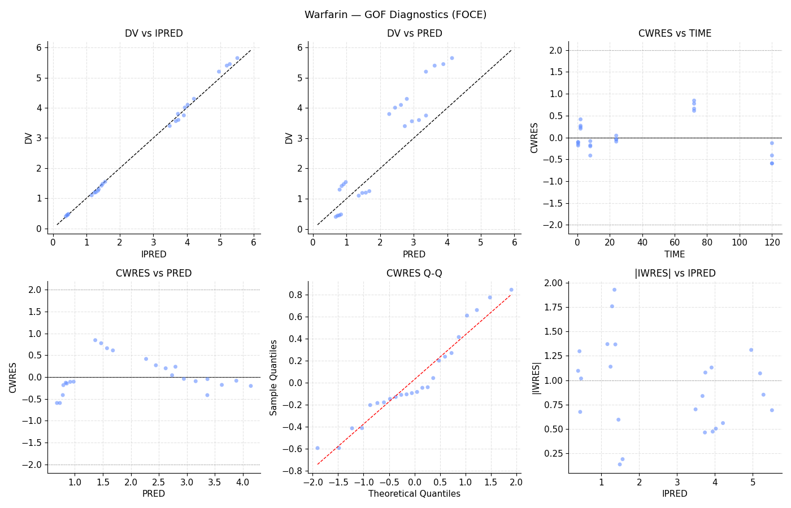
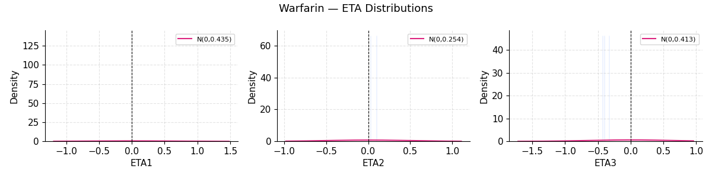

# Example 2 — Warfarin (FOCE)

**Model:** 1-compartment oral, FOCEI
**Script:** `examples/02_warfarin_foce.py`

Demonstrates FOCE with interaction on a 10-subject warfarin dataset.

## Model

```python
result = (
    ModelBuilder()
    .problem("Warfarin 1-cmt oral FOCE")
    .data("warfarin.csv")
    .subroutines(advan=2, trans=2)
    .pk("""
        KA = THETA(1) * EXP(ETA(1))
        CL = THETA(2) * EXP(ETA(2))
        V  = THETA(3) * EXP(ETA(3))
    """)
    .error("Y = F * (1 + EPS(1))")
    .theta([(0.01, 0.9, 20),
            (0.001, 0.13, 5),
            (0.1, 8.7, 200)])
    .omega([0.4, 0.3, 0.3])
    .sigma(0.05)
    .estimation(method="FOCE", interaction=True, maxeval=800)
    .build()
    .fit()
)
```

## Output

```{literalinclude} ../_static/examples/02_output.txt
:language: text
```

## Figures




## Notes

- `interaction=True` is recommended when proportional error is used with FOCE.
- Eta shrinkage for this small dataset may be high (>30%) — interpret
  individual estimates with caution.
