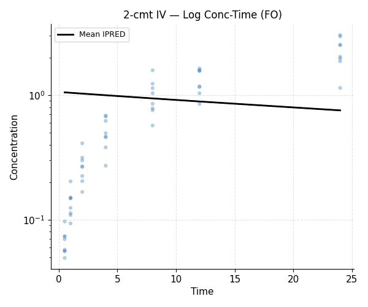
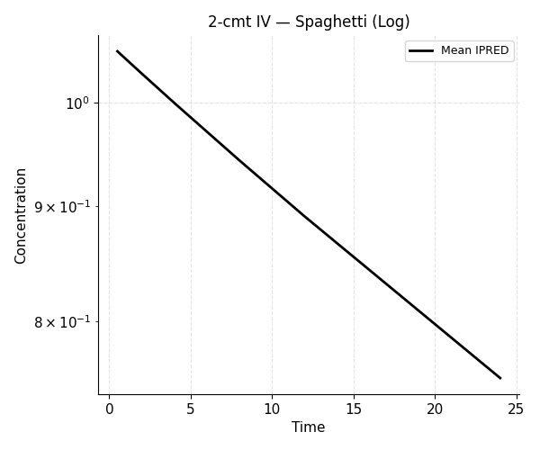

# Example 3 — Two-Compartment IV (ADVAN3)

**Model:** 2-compartment IV bolus, ADVAN3 with micro-rate mapping in `$PK`, First Order
**Script:** `examples/03_two_compartment_iv.py`

Demonstrates estimation with a 2-compartment model on simulated IV data.

## Model

```python
result = (
    ModelBuilder()
    .problem("2-cmt IV ADVAN3 FO")
    .data("two_cmt_iv.csv")
    .subroutines(advan=3, trans=1)
    .pk("""
        CL = THETA(1) * EXP(ETA(1))
        V1 = THETA(2) * EXP(ETA(2))
        Q  = THETA(3)
        V2 = THETA(4)
        K   = CL / V1
        K12 = Q / V1
        K21 = Q / V2
    """)
    .error("Y = F * (1 + EPS(1))")
    .theta([(0.01, 1.6, 30),
            (1.0, 8.0, 100),
            (0.1, 0.64, 10),
            (1.0, 8.0, 100)])
    .omega([0.4, 0.4])
    .sigma(0.05)
    .estimation(method="FO", maxeval=600)
    .build()
    .fit()
)
```

## Output

```{literalinclude} ../_static/examples/03_output.txt
:language: text
```

## Figures




## Biexponential decline

The 2-compartment model produces a biexponential concentration-time profile.
On a log scale this appears as two distinct slopes (distribution and elimination
phases).

## Notes

- ADVAN3 uses eigenvalue decomposition of the 2×2 rate constant matrix.
- With small sample sizes FO may converge to a local minimum — try FOCE
  if estimates look unreasonable.
- Peripheral compartment initial estimates (`Q`, `V2`) often need careful
  tuning; start near physiologically reasonable values.
