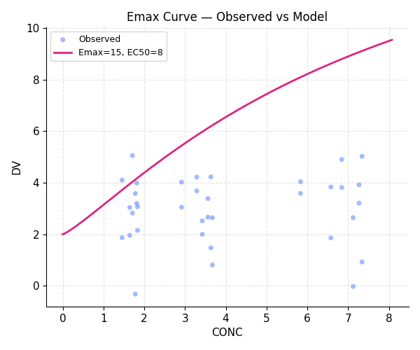
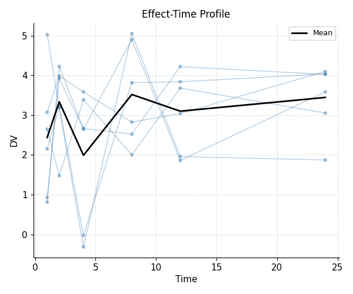
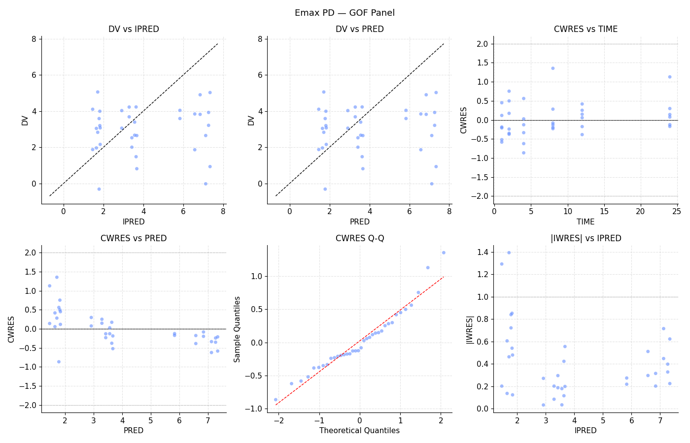

# Example 4 — Emax PD Model

**Model:** 1-compartment IV PK + direct Hill Emax PD in `$ERROR`
**Script:** `examples/04_emax_pd_model.py`

Demonstrates a combined PK/PD model where the pharmacodynamic relationship
is coded inside the `$ERROR` block using the PK prediction `F` as the
driving concentration.

## `$ERROR` block

The Hill equation is implemented directly in `$ERROR`:

```
E0   = THETA(3)
EMAX = THETA(4)
EC50 = THETA(5)
GAMMA = THETA(6)
IPRED = E0 + EMAX * F**GAMMA / (EC50**GAMMA + F**GAMMA)
W     = THETA(7)
Y     = IPRED + W * EPS(1)
IRES  = DV - IPRED
IWRES = IRES / W
```

## Full model

```python
result = (
    ModelBuilder()
    .problem("1-cmt IV + Emax PD (Hill)")
    .data("emax_pd.csv")
    .subroutines(advan=1, trans=2)
    .pk("""
        K = THETA(1) * EXP(ETA(1))
        V  = THETA(2) * EXP(ETA(2))
    """)
    .error("""
        E0    = THETA(3)
        EMAX  = THETA(4)
        EC50  = THETA(5)
        GAMMA = THETA(6)
        IPRED = E0 + EMAX * F**GAMMA / (EC50**GAMMA + F**GAMMA)
        W     = THETA(7)
        Y     = IPRED + W * EPS(1)
        IRES  = DV - IPRED
        IWRES = IRES / W
    """)
    .theta([(0.01, 0.15, 5.0),
            (1.0, 10.0, 100.0),
            (0.0, 2.0, 20.0),
            (1.0, 15.0, 100.0),
            (0.1, 8.0, 100.0),
            (0.1, 1.2, 5.0),
            (0.1, 1.5, 20.0)])
    .omega([0.3, 0.3])
    .sigma(1.0, fixed=True)
    .estimation(method="FO", maxeval=600)
    .build()
    .fit()
)
```

## Output

```{literalinclude} ../_static/examples/04_output.txt
:language: text
```

## Figures





## Notes

- `SIGMA` is fixed to 1 and `THETA(7)` (W) absorbs the residual error scale —
  this is standard practice for models with custom `W` in `$ERROR`.
- The Hill coefficient `GAMMA` is bounded `(0.1, 1.2, 5.0)` to keep the curve
  physiologically reasonable.
- With a direct effect model, hysteresis in the C–E loop indicates the
  assumption of instantaneous equilibrium may be violated.
