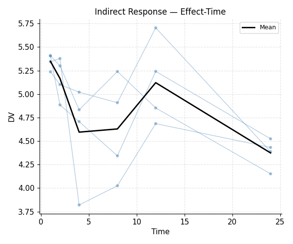
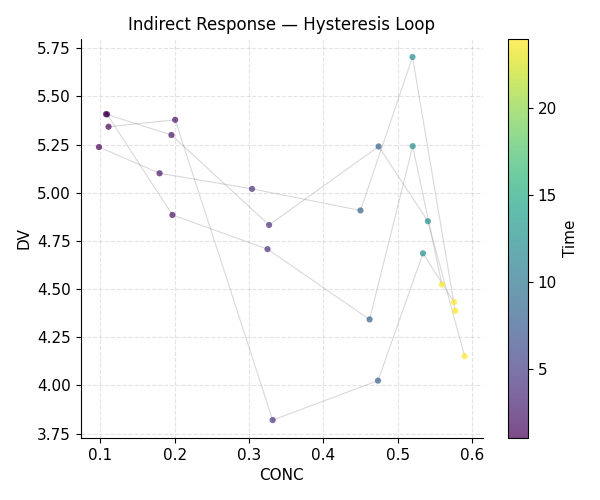

# Example 5 — Indirect Response Model

**Model:** 1-compartment IV PK + indirect-response simulation, fitted with a direct Emax approximation
**Script:** `examples/05_indirect_response.py`

This example simulates an indirect response model with `scipy.integrate`, then
fits the resulting observations with a simplified direct Emax approximation in
`$ERROR`.

## Pharmacodynamic model

The simulation uses an inhibitory turnover model:

```
dR/dt = Kin * (1 - IMAX * C / (IC50 + C)) - Kout * R
```

where `C` is the PK driving function (ADVAN1 central compartment).

Because the example simulates the turnover system externally, the fitted model
uses a pragmatic direct-effect approximation inside `$ERROR` rather than a
full turnover ODE during estimation.

## Key concepts

```python
# Approximate direct-effect fit used during estimation

.error("""
    E0    = THETA(3)
    EMAX  = THETA(4)
    EC50  = THETA(5)
    W     = THETA(6)
    IPRED = E0 + EMAX * F / (EC50 + F)
    Y     = IPRED + W * EPS(1)
    IRES  = DV - IPRED
    IWRES = IRES / W
""")
```

## Output

```{literalinclude} ../_static/examples/05_output.txt
:language: text
```

## Figures




## Notes

- The example illustrates simulation of a turnover model and fitting with a
  simpler approximation, not a full turnover fit.
- Counter-clockwise hysteresis in the C–E plot is a hallmark of indirect
  response models (effect lags concentration).
- Clockwise hysteresis suggests tolerance, auto-induction, or distributional
  delay.
