# Example 7 — Full Diagnostic Plot Gallery

**Script:** `examples/07_diagnostic_plots.py`

A complete walkthrough of every diagnostic plot function using the
theophylline FO model from {doc}`01_theophylline_fo`.

## Output

```{literalinclude} ../_static/examples/07_output.txt
:language: text
```

## Figures

### GOF panel (2×3 composite)

The panel contains DV vs IPRED, DV vs PRED, CWRES vs TIME, CWRES vs PRED,
CWRES Q-Q, and |IWRES| vs IPRED.


### Individual GOF plots

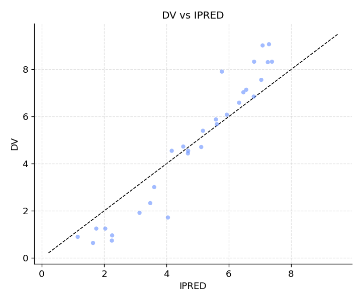
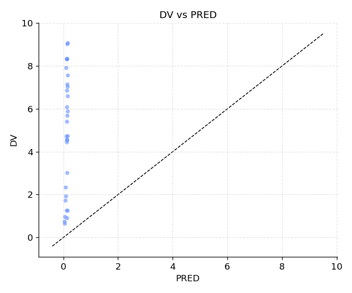
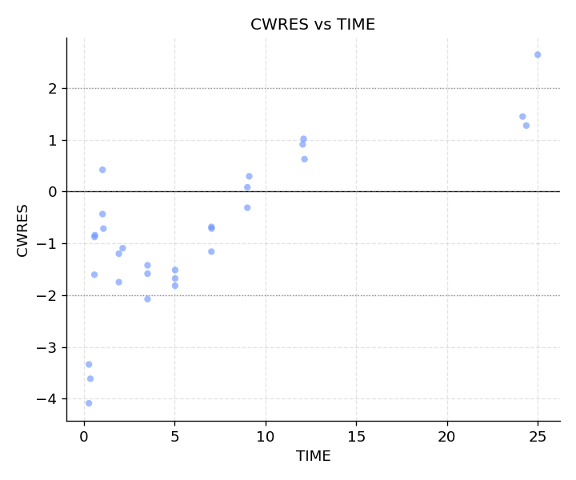
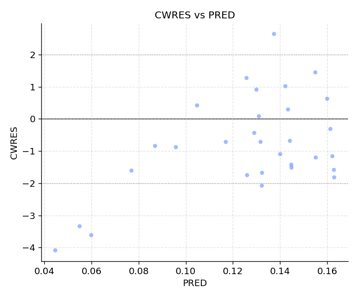
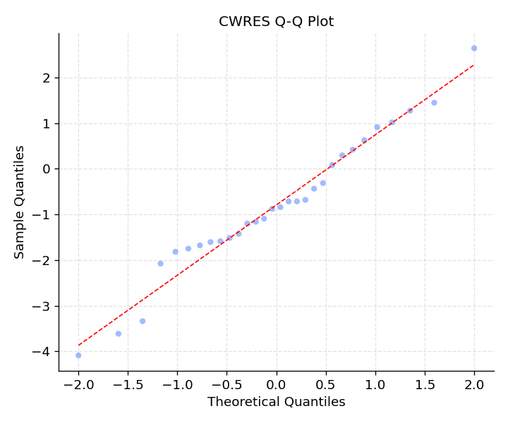
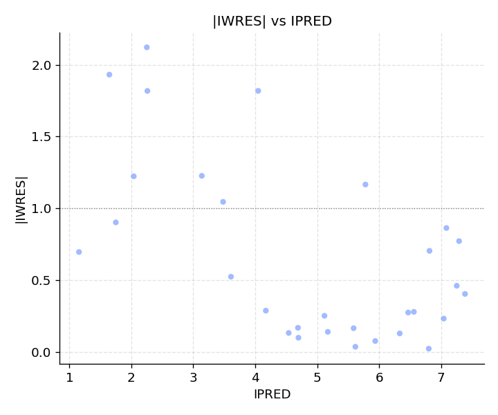

### PK concentration-time plots

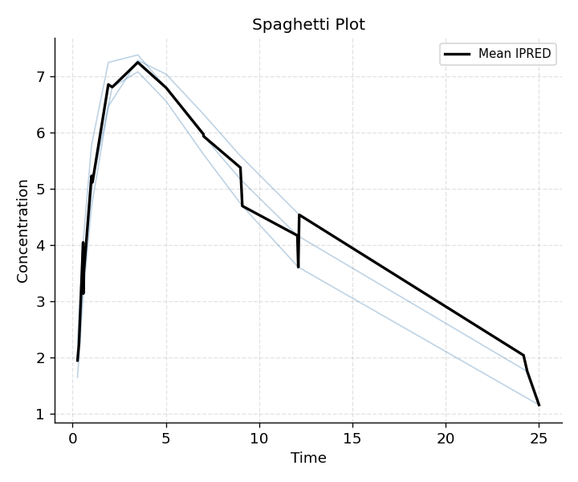
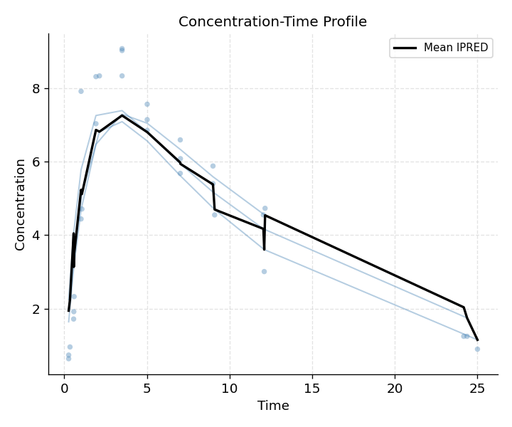
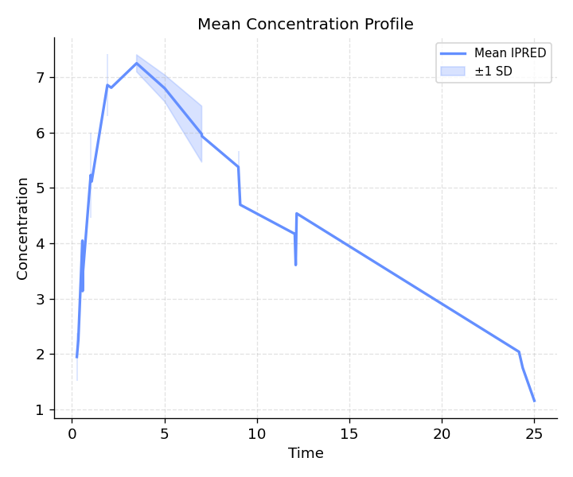

### ETA diagnostics

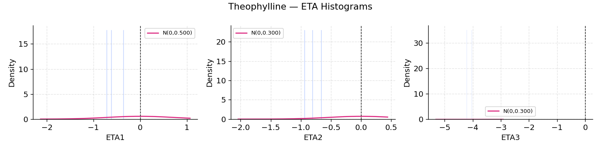
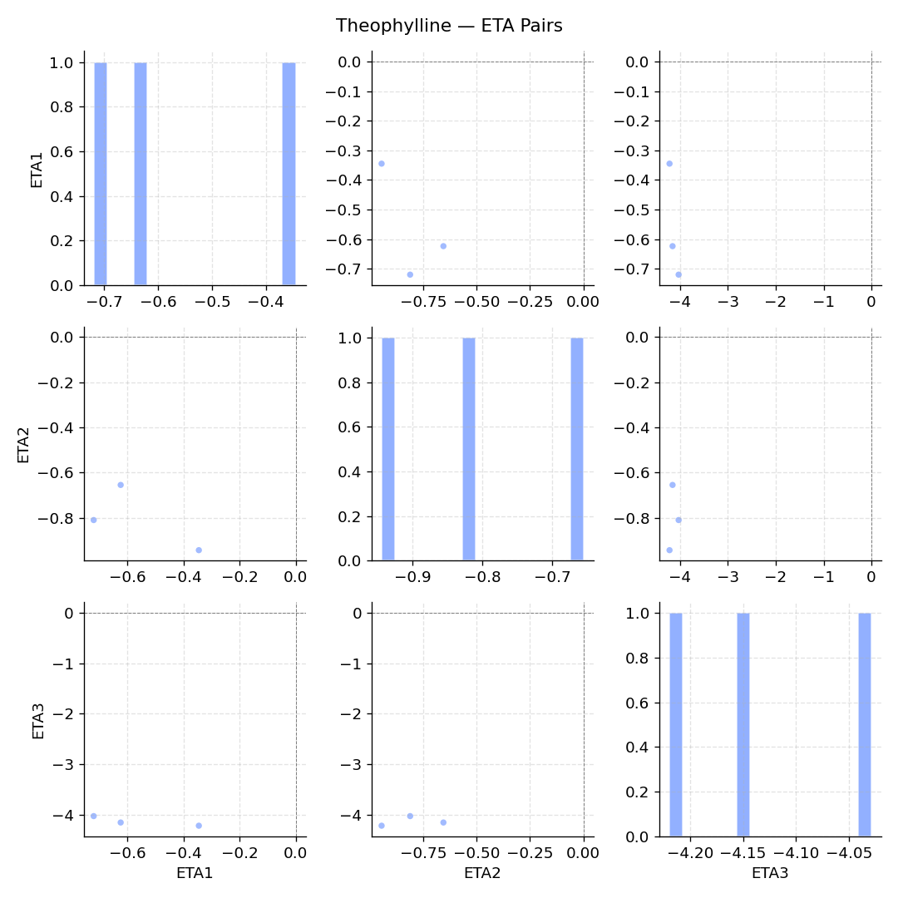
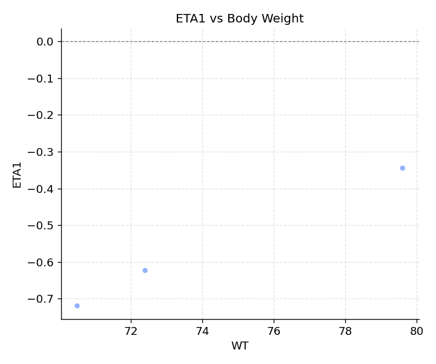

### OFV convergence

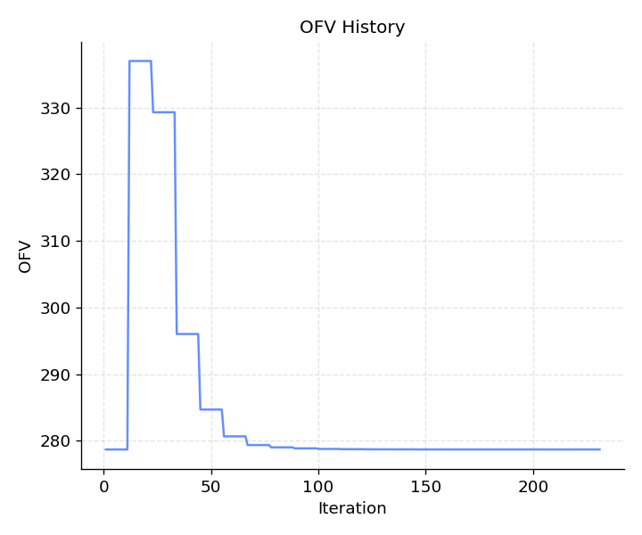

## Interpreting GOF plots

| Plot | What to look for |
|------|-----------------|
| DV vs IPRED / PRED | Points close to the identity line, no systematic bias |
| CWRES vs TIME | Random scatter around zero; no trend or funnel |
| CWRES vs PRED | Random scatter; no heteroscedasticity |
| CWRES Q-Q | Points on the diagonal line; normality of residuals |
| \|IWRES\| vs IPRED | Homogeneous spread; no increasing trend (proportional error check) |
| ETA histograms | Symmetric, approximately normal distributions |
| ETA pairs | No strong correlations (would suggest OMEGA mis-specification) |
| ETA vs covariates | Flat relationship (no unexplained covariate effect) |
