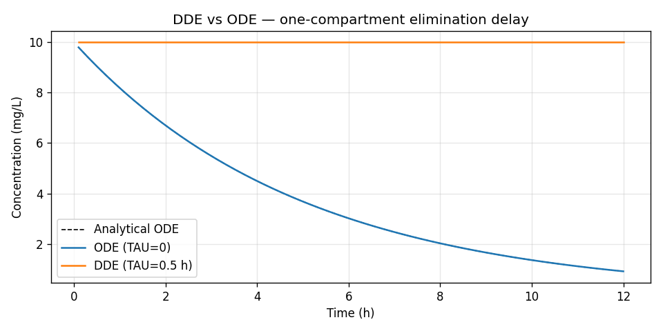

# Example 16: Delay Differential Equation (DDE) PK model

**Script**: `examples/16_dde_model.py`

Demonstrates:
- `DDESubroutine` (ADVAN16) for delay-dependent elimination kinetics
- The `_AHISTORY` history function injected into `pk_params`
- Comparing DDE output with a standard ODE reference (TAU = 0)
- Plotting the separation between delayed and non-delayed systems

## Background

Standard PK ODEs compute rates from the *current* state **A**(*t*).
Delay differential equations allow the rate to depend on the state at a
*past* time **A**(*t* − τ):

```
dA/dt = −(CL/V) · A(t − τ)
```

This arises in:
- **Transit absorption** — drug traverses *n* transit compartments before
  reaching the sampling site
- **Receptor feedback** — occupancy at time *t* drives elimination at *t* + τ
- **Cell-cycle models** — cells require τ hours to mature before dividing

## Key code

```python
from openpkpd.pk.ode.dde import DDESubroutine

def dde_des(t, A, pk_params, theta, eta):
    hist = pk_params.get("_AHISTORY")   # injected by DDESubroutine
    tau  = pk_params.get("TAU", 0.0)
    ke   = pk_params["CL"] / pk_params["V"]

    if hist is not None and tau > 0:
        A_lag = hist(max(t - tau, 0.0))  # A at time t − tau
        return [-ke * A_lag[0]]
    return [-ke * A[0]]  # degenerate to ODE when tau = 0

solver = DDESubroutine(n_compartments=1)
sol = solver.solve(
    pk_params={"CL": 2.0, "V": 10.0, "TAU": 0.5},
    dose_events=dose_events,
    obs_times=obs_times,
    des_callable=dde_des,
)
# sol.ipred — concentration array at obs_times
```

## Output

```{literalinclude} ../_static/examples/16_output.txt
:language: text
```

## Figures



## Running

```bash
python examples/16_dde_model.py
```

## See also

- {doc}`../user_guide/advanced_pk` — DDE architecture and API reference
- `examples/08_ode_transit_absorption.py` — Transit compartment approximation
