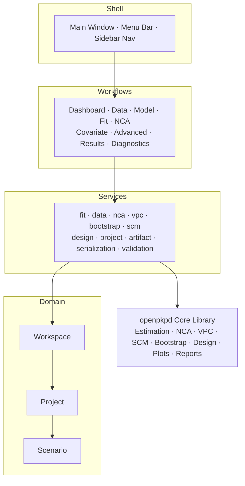
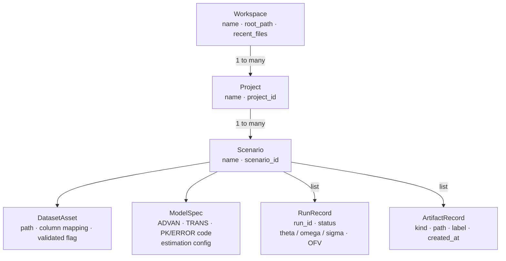

# Desktop GUI

The OpenPKPD desktop GUI is organised around a simple hierarchy:

- **Workspace** → the full session shown in the application window
- **Project** → a modelling effort or study
- **Scenario** → a branch within a project (for example `Baseline`, `NCA`, or a covariate variant)
- **Workflow page** → a task-focused screen such as **Data**, **Model**, or **Results**

Use the Help dialog table of contents to jump directly to the section you need.
The **Help → Help for this workflow** action opens this guide focused on the
current workflow page.

## GUI architecture

## Quick start

If you are new to the GUI, the most common end-to-end path is:

1. Create or open a project.
2. Load data in **Data**.
3. Define the model in **Model**.
4. Run estimation in **Fit**.
5. Review outputs in **Results**, **Plots**, and **Diagnostics**.
6. Save a snapshot (`.opkpd`) so the workspace can be restored later.

### Common tasks at a glance

| If you want to… | Go to… | Notes |
|---|---|---|
| Load a CSV or sample dataset | **Data workflow** | Import your own file or load a bundled example |
| Build or edit a model | **Model workflow** | Builder and code views stay in sync with saved state |
| Estimate model parameters | **Fit workflow** | Uses the current scenario dataset + model |
| Run non-compartmental analysis | **NCA workflow** | Works without a compartmental fit |
| Review reports, logs, and artifacts | **Results workflow** | Best place to inspect completed fits |
| Browse plot artifacts | **Results workflow** | Filter by kind = `png` / `svg` in the artifact panel |
| Review diagnostics / generate NPDE | **Diagnostics workflow** | Focused fit-quality outputs |
| Run VPC / bootstrap / design tools | **Advanced workflow** | Post-fit analysis tabs |
| Run stepwise covariate modelling | **Covariate workflow** | Requires a ready base model |
| Save or reload the whole workspace | **Workspace menu** | Uses `.opkpd` snapshots |

## Shell basics

### Workspace, projects, and scenarios

- A **workspace** can contain multiple projects.
- Each **project** contains one or more scenarios.
- Each new project starts with a default **Baseline** scenario.
- Scenario workflows are independent enough to support branching experiments:
  one scenario can hold the base fit, another can hold an NCA-only analysis,
  and another can test covariate extensions.

### Navigation and layout

The main window is split into two primary regions:

- **Sidebar / workflow tree** — projects, scenarios, and workflow pages
- **Main content area** — the selected workflow page

The shell also includes:

- a project/context header on key pages
- workflow status strips for readiness and recent progress
- responsive layouts that stack on narrower window widths

### Menu overview

#### Workspace menu

Typical actions include:

- **New Project…**
- **New Scenario…**
- **Load Project Snapshot…**
- **Save Project Snapshot** / **Save Project Snapshot As…**
- scenario import/export actions where supported

#### Help menu

- **Help for this workflow** — opens this guide focused on the active workflow
- **User Guide** — opens the full guide from the top
- **About OpenPKPD GUI** — version/about dialog

### Preferences and defaults

The Preferences dialog is where you set shell-wide defaults such as:

- **Default workspace files location**
- UI presentation preferences such as font sizing
- **CPU cores for estimation/simulation**

The default workspace files location is used as the starting directory for save
and snapshot dialogs when an item does not already have a more specific path.

#### CPU cores (parallelism)

The **CPU cores for estimation/simulation** spinner controls how many parallel
workers the GUI uses when running estimation and simulation jobs.

| Value | Behaviour |
|---|---|
| **0 (Auto)** | Use all available CPU cores. Recommended for most users. |
| **1** | Serial execution — one subject or replicate at a time. |
| **N > 1** | Use exactly N parallel workers. |

The spinner label shows the number of cores detected on your machine at startup
(`Auto (N cores detected)`).

Parallelism is applied to:

- **FOCE / FOCEI inner-loop** — per-subject η optimisation (process-based, true multi-core).
- **SAEM E-step** — per-subject Metropolis–Hastings proposals (thread-based).
- **IMP subject evaluations** — per-subject importance sampling (thread-based).
- **VPC simulation replicates** — each replicate is dispatched to a thread worker.

Methods that are inherently serial (FO, Laplacian, BAYES, Nonparametric) are
unaffected by this setting.

The preference is saved across sessions. It takes effect the next time a fit or
VPC job is started — no restart required.

#### Estimation controls currently exposed in the GUI

The model builder currently exposes the following estimation controls directly:

- estimation method selection (`FO`, `FOCE`, `FOCEI`, `LAPLACIAN`, `SAEM`, `IMP`)
- `maxeval`
- `n_starts` (multi-start)
- tight `gtol` for gradient-based methods

More advanced FOCE/FOCEI optimizer controls such as outer-optimizer selection,
fallback/polish optimizers, best-iterate retention, and structured retry
settings are currently available through control streams and the Python API,
not as dedicated GUI fields.

### Snapshots and recent files

The GUI snapshot format is `.opkpd`.

Project snapshots preserve the workspace state, including:

- projects and scenarios
- active selection
- saved workflow inputs
- run history
- registered artifacts
- references to external files

When loading a snapshot, the GUI prompts before discarding unsaved changes.
If external files are missing, the workspace metadata is still restored so you
can reconnect those files later.

## Workflow guide

### Dashboard workflow

The **Dashboard** page is the fastest way to assess a scenario’s status.

It summarizes:

- dataset readiness
- model readiness
- fit/NCA/results availability
- recommended next actions

Use the Dashboard when you want to answer: *What is ready? What still needs
attention? What should I do next?*

### Data workflow

The **Data** page is where datasets are loaded, previewed, and validated.

#### Main areas

- **Example dataset controls** — filter, browse, and load bundled examples
- **Import row** — import a CSV from disk
- **Options row** — separator, quote/comment, and whitespace handling
- **Columns panel** — dataset column list
- **Preview panel** — row preview table
- **Validation panel** — warnings and errors from the imported dataset

#### Typical usage

1. Load an example dataset or import a CSV.
2. Confirm the source path and parsing options are correct.
3. Review columns and preview rows.
4. Resolve validation errors before moving to **Model**.

### Model workflow

The **Model** page defines the active model state for the scenario.

#### Model mode

Two radio buttons at the top select the model input mode:

- **Builder** — a form-based editor for ADVAN/TRANS selection, THETA/OMEGA/SIGMA tables, PK/ERROR code, and estimation settings.  This is the default for new models.
- **Control stream** — a plain-text editor for loading or writing a NONMEM-style `.ctl` file directly.

Switching modes is instant; the scenario retains the last-saved state regardless of which view is active.

#### Main areas

- **Configuration panel** (Builder mode) — dataset path, ADVAN/TRANS, estimation method, and THETA/OMEGA/SIGMA parameter tables
- **Translation panel** — translation summary, validation output, and code editor view
- **Control stream panel** (Control stream mode) — plain-text editor plus example and file-open controls

#### Help buttons

Each major control group has a **?** help button.  Clicking it shows a tooltip with a description of that control's purpose, accepted values, and any tips.  Hover the button briefly to see the tooltip text without clicking.

#### Control stream mode — example control streams

When **Control stream** mode is active, an **Examples** group appears below the editor with:

- a searchable dropdown listing all bundled example control streams
- a **Load example** button to apply the selected example
- an **Open from file…** button to load a `.ctl` file from disk

#### Dataset handling in control stream mode

When you open a control stream (via **Load example** or **Open from file…**), the GUI reads the `$DATA` path embedded in the control stream and automatically loads that CSV onto the **Data** screen, replacing any previously loaded dataset.

**Priority at fit time:**
- If you subsequently load a different dataset on the **Data** screen, that dataset takes precedence over the control stream's `$DATA` path.
- If no dataset has been loaded on the **Data** screen, the fit falls back to the `$DATA` path from the control stream.

This means you can open any bundled example and run it without touching the **Data** page at all, while retaining the ability to substitute your own data by loading it on the **Data** page.

#### Key capabilities

- switch between Builder and Control stream input modes without losing saved state
- maintain builder-based model metadata and inspect generated code
- validate the model before estimation
- save model state back into the scenario

#### Typical usage

**Using Builder mode:**

1. Confirm the correct dataset is attached.
2. Set the problem title and structural model settings.
3. Review/edit THETA, OMEGA, and SIGMA values.
4. Validate the translation.
5. Click **Save model state** before moving to **Fit**.

**Using Control stream mode:**

1. Select **Control stream** in the mode radio buttons.
2. Choose a bundled example from the **Examples** dropdown and click **Load example**, or click **Open from file…** to load your own `.ctl` file.
3. The `$DATA` file referenced in the control stream is loaded automatically onto the **Data** screen.
4. Edit the control stream text if needed.
5. Click **Save model state** before moving to **Fit**.

### Fit workflow

The **Fit** page checks scenario readiness for estimation and launches the fit.

#### Main areas

- **Preparation panel** — readiness summary plus validation items
- **Run panel** — latest run summary and streaming log output
- **Action row** — refresh readiness and run the fit

#### Preparation summary states

The summary label at the top of the preparation panel reflects the current state:

| Label | Meaning |
|---|---|
| **Ready to start fit** | Dataset and model are valid; the fit can be started. |
| **Fit in progress** | A fit is currently running. Wait for it to finish before starting another. |
| **Fit needs attention** | One or more validation items must be resolved first. |

#### Typical usage

1. Open **Fit** after saving dataset + model state.
2. Read the preparation summary.
3. Confirm the validation list is clear.
4. Click **Run fit**.
5. Watch the run log and status updates.

### NCA workflow

The **NCA** page supports standalone non-compartmental analysis.

#### Main areas

- **Options row** — route, AUC method, λz settings, and terminal-phase options
- **Readiness panel** — dataset validation and preparation summary
- **Results panel** — latest run summary, preview output, and logs
- **Action row** — refresh, open results, open artifacts folder, and run NCA

#### Typical usage

1. Load a concentration-time dataset in **Data**.
2. Open **NCA** and review the readiness panel.
3. Configure route and AUC options.
4. Click **Run NCA**.
5. Review the generated CSV summary artifact.

### Results workflow

The **Results** page focuses on fit runs, saved artifacts, and common follow-up
actions.

#### Runs list

Lists all fit runs for the selected scenario in reverse chronological order.
Each row shows status, short run ID, and either the summary text or the error
message. Selecting a row populates the detail and artifact panels.

#### Detail panel

- **Run detail label** — status and summary for the selected run
- **Run metadata label** — started/finished timestamps, log line count, artifact count
- **Run log** — full scrollable log output for the run

#### Artifact panel

**Filter row**:

| Control | Description |
|---|---|
| **Kind filter** combo | Filter by artifact kind (`html`, `csv`, `png`, etc.) |
| **Role** combo | Filter by logical role (`report`, `plot`, `diagnostics_table`, etc.) |
| **Plot type** combo | Filter by plot type (`gof_panel`, `cwres_vs_time`, `vpc`, etc.) |

**Quick actions**:

- **Open latest report** — open the latest HTML/PDF report
- **Open latest plot** — open the latest combined plot artifact
- **Save latest plot copy…** — copy the latest plot to another path
- **Open convergence** — open the convergence / OFV-history plot
- **Open GOF review** — open the GOF panel artifact
- **More actions** dropdown (fit review): residual review, profiles, ETA review
- **Save copy…** — copy the selected artifact to disk
- **Open artifact** — open the selected artifact in the system viewer
- **More actions** dropdown (artifact): diagnostics CSV, NPDE CSV, or containing folder

**Artifact preview** — inline preview of the selected artifact.  The preview adapts to the artifact type:

| Type | Preview |
|---|---|
| `.html` | Rendered HTML with relative asset links resolved |
| `.csv` | Interactive sortable table with column headers |
| `.txt`, `.log`, `.json`, `.md` | Plain-text browser |
| `.png`, `.jpg`, `.svg` | Image viewer with scroll support |

### Plots workflow

The **Plots** page provides a browsable gallery of plot artifacts produced by
fit, simulation, VPC, and other runs for the selected scenario.

#### Plot list

Lists all plot artifacts for the selected scenario grouped by run.  Each row
shows the artifact label, plot type, and file path.  Selecting a row loads the
preview panel.

#### Preview panel

Displays the selected plot inline.  Supports PNG, SVG, and HTML plot formats.
Use the **Open** button to open the artifact in the system viewer, or **Save
copy…** to export it to another location.

#### Filter controls

| Control | Description |
|---|---|
| **Plot type** combo | Filter the list by plot type (`gof_panel`, `vpc`, `cwres_vs_time`, etc.) |
| **Run** combo | Restrict the list to artifacts from a specific run |

### Diagnostics workflow

The **Diagnostics** page focuses on fit-quality outputs and diagnostics tables.

The page shows:

- **Overview label** — scenario name, dataset/model readiness, latest fit status, artifact count
- **Status label** — whether the plotting stack is available
- **Next steps label** — contextual guidance based on the current scenario state
- **Capabilities label** — supported diagnostics outputs
- **NPDE status label** — NPDE availability and whether an NPDE CSV exists

#### Filter row

| Control | Description |
|---|---|
| **Role** combo | Filter by artifact role |
| **Plot type** combo | Filter by plot type |

#### Action buttons

| Button | Description |
|---|---|
| **Open GOF panel** | Opens the goodness-of-fit panel for the latest fit |
| **Open residual trends** | Opens the CWRES / residual trend artifact |
| **Generate NPDE CSV** | Runs background NPDE generation (requires a fit in this session) |
| **Open diagnostics CSV** | Opens the diagnostics table CSV |
| **Open NPDE CSV** | Opens the NPDE results CSV |
| **Save copy…** | Copies the selected artifact to disk |
| **Open artifact** | Opens the selected artifact in the system viewer |
| **Open folder** | Opens the artifact folder |
| **Refresh diagnostics** | Refreshes all status labels and artifact lists |

### Advanced workflow

The **Advanced** page is a tabbed hub for post-fit validation and design tools.

The current tabs are:

- **VPC**
- **Bootstrap**
- **Design**
- **Artifacts**

#### VPC tab

| Control | Range / Default | Description |
|---|---|---|
| **Replicates** spinbox | 10–5000, default 200 | Number of simulation replicates |
| **Bins** spinbox | 2–50, default 10 | Number of time-axis bins |
| **Seed** spinbox | 1–999999, default 42 | Random seed for reproducibility |
| **Prediction-corrected** checkbox | off | Enable pcVPC normalisation |

**Run VPC** is enabled only when a fit was completed in the GUI session.
Replicates are distributed across worker threads using the **CPU cores**
setting from Preferences (0 = auto).

#### Bootstrap tab

| Control | Range / Default | Description |
|---|---|---|
| **Replicates** spinbox | 10–2000, default 100 | Number of bootstrap samples |
| **Jobs** spinbox | 1–64, default 1 | Parallel worker count |
| **Seed** spinbox | 1–999999, default 42 | Random seed |
| **CI level** spinbox | 0.50–0.99, default 0.95 | Confidence interval level for BCa |

**Run bootstrap** generates summary, CI, and sample-table artifacts.

#### Design tab

The Design tab exposes optimal-design controls including sample counts, subject
counts, time windows, optimality criterion, and optimization method.

**Run design** generates summary, metrics, schedule, FIM, and expected-SE
artifacts from the latest successful fit.

#### Artifacts tab

The Artifacts tab browses the shared Advanced artifact pool.

| Scope | Description |
|---|---|
| **All** | All advanced artifacts |
| **VPC** | `vpc_summary` and VPC-type plot artifacts |
| **Bootstrap** | `bootstrap_summary`, `bootstrap_ci_table`, `bootstrap_samples` |
| **Design** | `design_summary`, `design_metrics`, `design_schedule`, `design_fim`, `design_expected_se` |

### Covariate workflow

The **Covariate** page exposes stepwise covariate modelling (SCM) against the
active base model.

#### Candidates table

Columns: **Parameter**, **Covariate**, **Effect**, **Reference**

- **Parameter** — PK parameter to test (for example `CL`, `V`)
- **Covariate** — dataset column to use (for example `WT`, `AGE`)
- **Effect** — relationship type: `power`, `linear`, `exp`, `categorical`
- **Reference** — reference value for continuous covariates

Use **Add candidate** and **Remove selected** to manage the list.

#### Search parameters

| Control | Range / Default | Description |
|---|---|---|
| **Forward p-value** | 0.001–0.5, default 0.05 | Inclusion threshold for the forward step |
| **Backward p-value** | 0.0001–0.5, default 0.001 | Exclusion threshold for the backward step |
| **Parallel jobs** | −1–64, auto | Number of parallel estimation jobs (−1 = auto) |

#### Results table

Columns: **Type**, **Relationship**, **ΔOFV**, **p-value**, **Status**.

#### Action buttons

| Button | Description |
|---|---|
| **Refresh readiness** | Re-check that the base model and dataset are ready |
| **Run SCM** | Submit the stepwise covariate search |

## End-to-end walkthroughs

### Walkthrough 1 — Theophylline one-compartment FOCE from scratch

This walkthrough fits the classic theophylline oral one-compartment PK dataset
using FOCE estimation.

#### Step 1 — Create the project

1. Launch the GUI (`openpkpd-gui`).
2. In the **Workspace** menu, choose **New Project…** and enter a name such as `Theophylline`.
3. The GUI creates a default `Baseline` scenario.

#### Step 2 — Load the dataset

1. Select `Baseline` → **Data**.
2. Type `theo` in **Filter examples**.
3. Select `theophylline` and click **Load example**.
4. Confirm the validation panel shows no blocking issues.

#### Step 3 — Define the model

1. Select `Baseline` → **Model**.
2. Ensure the **Builder** radio button is selected (the default).
3. Set **Problem title** to `Theophylline 1-CMT oral`.
4. Click **Use active dataset**.
5. Set **ADVAN** = `2`, **TRANS** = `2`, **Estimation** = `FOCE`.
6. Review THETA initial estimates.
7. Click **Save model state**.

> **Alternative:** Select the **Control stream** radio button, pick a theophylline example from the Examples dropdown, and click **Load example**.  The dataset is loaded automatically.

#### Step 4 — Run the fit

1. Select `Baseline` → **Fit**.
2. Confirm the preparation panel says the fit is ready.
3. Click **Run fit**.
4. Wait for the status to update to `Latest run — Succeeded`.

#### Step 5 — Review results

1. Open `Baseline` → **Results** to inspect the fit, report artifacts, and plot outputs.
2. Open `Baseline` → **Diagnostics** for CWRES and other diagnostics outputs.

#### Step 6 — Save the snapshot

1. Choose **Workspace → Save Project Snapshot…**.
2. Save the `.opkpd` archive so the entire workspace can be restored later.

### Walkthrough 2 — Standalone NCA on a plasma concentration dataset

This walkthrough runs non-compartmental analysis without a compartmental fit.

#### Step 1 — Create the scenario

1. In an existing or new project, select the project.
2. Choose **Workspace → New Scenario…** and name it `NCA`.

#### Step 2 — Load the dataset

1. Open the scenario’s **Data** workflow.
2. Import a CSV with at least `ID`, `TIME`, `DV`, and `EVID`.
3. Confirm the preview and validation panels look correct.

#### Step 3 — Configure and run NCA

1. Open `NCA` → **NCA**.
2. Set route, AUC method, and λz options.
3. Confirm the readiness panel reports the dataset cleanly.
4. Click **Run NCA**.
5. Review the latest results summary and preview output.

### Walkthrough 3 — Post-fit VPC and covariate search

This walkthrough assumes you already completed the fit from Walkthrough 1.

#### Step 1 — Generate a VPC

1. Select `Baseline` → **Advanced**.
2. On the **VPC** tab, set replicates, bins, and seed.
3. Click **Run VPC**.
4. Open the **Artifacts** tab and filter **Scope** = `VPC` to review the output.

#### Step 2 — Configure the covariate search

1. Select `Baseline` → **Covariate**.
2. Add one or more candidates such as `CL ~ WT`.
3. Set forward/backward thresholds and parallel job settings.

#### Step 3 — Run SCM

1. Click **Run SCM**.
2. Review accepted and rejected relationships in the results table.
3. Use accepted relationships as the basis for a derived scenario/model update.

## Troubleshooting and tips

### Common reasons a button is disabled

- **Fit / SCM / NCA run buttons** are often disabled because required dataset or model state is incomplete.
- Read the readiness summary on the current workflow page first.
- Review validation lists before assuming a background runner failed.

### Choosing the right review page

- Use **Results** when you want run-centric context, logs, and all artifacts (use the kind filter in the artifact panel to narrow to plots).
- Use **Diagnostics** when you want fit-quality outputs or NPDE-specific actions.

### Saving and sharing work

- Use **Save Project Snapshot…** to preserve the whole workspace.
- Use **Save copy…** actions on Results / Plots / Diagnostics when you only need one artifact.
- Set a sensible **Default workspace files location** in Preferences so save dialogs open where you expect.

### Help resources

- **Help → Help for this workflow** jumps directly to the current workflow section.
- **Help → User Guide** opens the full guide from the top.
- If a workflow references artifacts, the scenario must usually have completed at least one relevant run.
