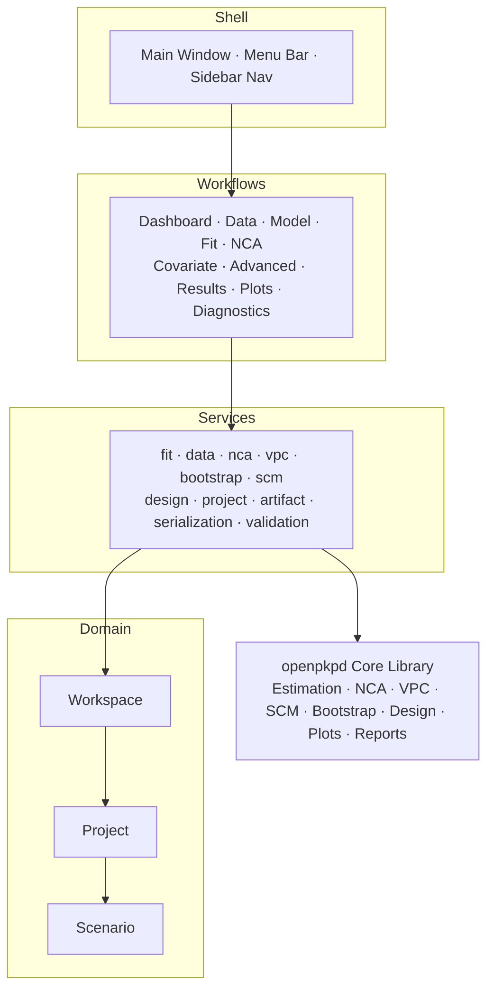
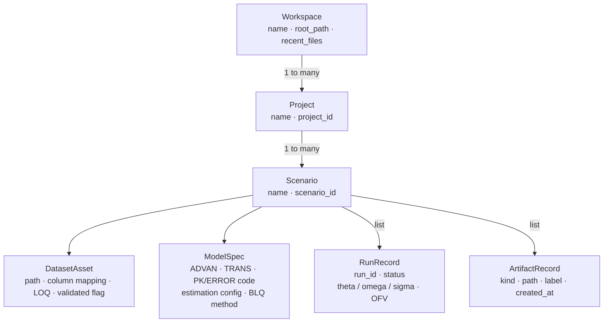

# Desktop GUI

The OpenPKPD desktop GUI is organised around a simple hierarchy:

- **Workspace** → the full session shown in the application window
- **Project** → a modelling effort or study
- **Scenario** → a branch within a project (for example `Baseline`, `NCA`, or a covariate variant)
- **Workflow page** → a task-focused screen such as **Data**, **Model**, or **Results**

Use the **Help → Help for this workflow** action to jump directly to the section
for the current page.

## GUI architecture

## Quick start

If you are new to the GUI, the most common end-to-end path is:

1. Create or open a project.
2. Load data in **Data**.
3. Define the model in **Model**.
4. Run estimation in **Fit**.
5. Review outputs in **Results**, **Plots**, and **Diagnostics**.
6. Save a snapshot (`.opkpd`) so the workspace can be restored later.

### Common tasks at a glance

| If you want to… | Go to… | Notes |
|---|---|---|
| Load a CSV or sample dataset | **Data workflow** | Import your own file or load a bundled example |
| Set a lower limit of quantification | **Data workflow** | LOQ spinner in the options row |
| Build or edit a model | **Model workflow** | Builder and code views stay in sync with saved state |
| Select BLQ handling (M1/M3) | **Model workflow** | BLQ method combo in estimation settings |
| Estimate model parameters | **Fit workflow** | Uses the current scenario dataset + model |
| Run non-compartmental analysis | **NCA workflow** | Works without a compartmental fit |
| Review reports, logs, and artifacts | **Results workflow** | Best place to inspect completed fits |
| Browse plot artifacts | **Plots workflow** | Filter by analysis and plot type |
| Review diagnostics / generate NPDE | **Diagnostics workflow** | Focused fit-quality outputs |
| Highlight a subject across GOF plots | **Diagnostics workflow** | Subject filter combo in the filter row |
| Run VPC / bootstrap / design tools | **Advanced workflow** | Post-fit analysis tabs |
| Run VPC with stratification or pcVPC | **Advanced workflow → VPC tab** | Stratify-by combo and pcVPC checkbox |
| Run stepwise covariate modelling | **Covariate workflow** | Requires a ready base model |
| Save or reload the whole workspace | **Workspace menu** | Uses `.opkpd` snapshots |

## Shell basics

### Workspace, projects, and scenarios

- A **workspace** can contain multiple projects.
- Each **project** contains one or more scenarios.
- Each new project starts with a default **Baseline** scenario.
- Scenario workflows are independent, supporting branching experiments:
  one scenario can hold the base fit, another an NCA-only analysis,
  and another a covariate extension.

### Navigation and layout

The main window is split into two primary regions:

- **Sidebar / workflow tree** — projects, scenarios, and workflow pages
- **Main content area** — the selected workflow page

The shell also includes:

- a project/context header on key pages
- workflow status strips for readiness and recent progress
- responsive layouts that stack on narrower window widths
- dismissible hint banners on first use of each workflow

### Menu overview

#### Workspace menu

Typical actions include:

- **New Project…**
- **New Scenario…**
- **Load Project Snapshot…**
- **Save Project Snapshot** / **Save Project Snapshot As…**
- scenario import/export actions where supported

#### Help menu

- **Help for this workflow** — opens this guide focused on the active workflow
- **User Guide** — opens the full guide from the top
- **About OpenPKPD GUI** — version/about dialog

### Preferences and defaults

The Preferences dialog is where you set shell-wide defaults such as:

- **Default workspace files location**
- UI presentation preferences such as font sizing
- **CPU cores for estimation/simulation**

The default workspace files location is used as the starting directory for save
and snapshot dialogs when an item does not already have a more specific path.

#### CPU cores (parallelism)

The **CPU cores for estimation/simulation** spinner controls how many parallel
workers the GUI uses when running estimation and simulation jobs.

| Value | Behaviour |
|---|---|
| **0 (Auto)** | Use all available CPU cores. Recommended for most users. |
| **1** | Serial execution — one subject or replicate at a time. |
| **N > 1** | Use exactly N parallel workers. |

The spinner label shows the number of cores detected on your machine at startup
(`Auto (N cores detected)`).

Parallelism is applied to:

- **FOCE / FOCEI inner-loop** — per-subject η optimisation (process-based, true multi-core).
- **SAEM E-step** — per-subject Metropolis–Hastings proposals (thread-based).
- **IMP subject evaluations** — per-subject importance sampling (thread-based).
- **VPC simulation replicates** — each replicate is dispatched to a thread worker.

Methods that are inherently serial (FO, Laplacian, BAYES, Nonparametric) are
unaffected by this setting.

The preference is saved across sessions. It takes effect the next time a fit or
VPC job is started — no restart required.

### Snapshots and recent files

The GUI snapshot format is `.opkpd`.

Project snapshots preserve the workspace state, including:

- projects and scenarios
- active selection
- saved workflow inputs
- run history
- registered artifacts
- references to external files

When loading a snapshot, the GUI prompts before discarding unsaved changes.
If external files are missing, the workspace metadata is still restored so you
can reconnect those files later.

## Workflow guide

### Dashboard workflow

The **Dashboard** page is the fastest way to assess a scenario's status.

It summarizes:

- dataset readiness
- model readiness
- fit/NCA/results availability
- recommended next actions

Use the Dashboard when you want to answer: *What is ready? What still needs
attention? What should I do next?*

Quick buttons for recent snapshots and **New Project / Open Snapshot** actions
are also available at the top of the Dashboard.

### Data workflow

The **Data** page is where datasets are loaded, previewed, and validated.

#### Main areas

- **Example dataset controls** — filter, browse, and load bundled examples with
  rich detail view (links to source files and URLs)
- **Import row** — import a CSV from disk via path or file-browser button
- **Options row** — separator character, quote/comment ignore character,
  treat-as-whitespace toggle, and scalar LOQ spinner
- **Columns panel** — dataset column list
- **Preview panel** — row preview table (first 100 rows)
- **Validation panel** — warnings and errors from the imported dataset

An unsaved-changes indicator appears when the import controls differ from the
saved dataset state.

#### Lower limit of quantification (LOQ)

The **LOQ** spinner in the options row lets you specify a scalar lower limit of
quantification.  When the dataset does not already contain an `LLOQ` column,
the GUI injects the value as a constant `LLOQ` column at fit time, making it
available to BLQ-aware estimation methods (see **Model workflow → BLQ method**).

| LOQ setting | Effect at fit time |
|---|---|
| **0.0 / None** | No LOQ injected — `LLOQ` column unchanged. |
| **> 0** | Written to a new `LLOQ` column if no `LLOQ` column exists. |

The LOQ value is persisted with the dataset import configuration across sessions.

#### Typical usage

1. Load an example dataset or import a CSV.
2. Confirm the source path and parsing options are correct.
3. If BLQ observations are present, enter the assay LOQ in the LOQ spinner.
4. Review the columns and preview panels.
5. Resolve validation errors before moving to **Model**.

### Model workflow

The **Model** page defines the active model state for the scenario.

#### Model mode

Two radio buttons at the top select the model input mode:

- **Builder** — a form-based editor for ADVAN/TRANS selection, THETA/OMEGA/SIGMA
  tables, PK/ERROR code, and estimation settings.  Default for new models.
- **Control stream** — a plain-text editor for loading or writing a NONMEM-style
  `.ctl` file directly.

Switching modes is instant; the scenario retains the last-saved state regardless
of which view is active.

#### Main areas

- **Configuration panel** (Builder mode) — dataset path, named model picker,
  ADVAN/TRANS spinners, estimation controls, and THETA/OMEGA/SIGMA parameter tables
- **Translation panel** — translation summary, validation output, and code view
- **Control stream panel** (Control stream mode) — plain-text editor plus example
  and file-open/save controls

Help buttons (**?**) on each section show tooltip descriptions of that control's
purpose, accepted values, and tips.

#### Named model presets

The **Named model** combo offers one-click presets for common ADVAN/TRANS pairs:

| Preset | ADVAN | TRANS |
|---|---|---|
| 1-compartment IV | 1 | 1 |
| 1-compartment oral | 2 | 2 |
| 2-compartment IV | 3 | 1 |
| 2-compartment oral | 4 | 4 |
| Custom ODE | 6 | — |

Selecting a preset fills in the ADVAN/TRANS spinners and default parameter tables
automatically.

#### Estimation settings

| Control | Description |
|---|---|
| **Estimation method** combo | `FO`, `FOCE`, `FOCEI`, `LAPLACIAN`, `SAEM`, `IMP`, `BAYES`, `NONPARAMETRIC` |
| **maxeval** spinbox | Maximum function evaluations |
| **n_starts** spinbox | Multi-start random restarts |
| **Tight gtol** checkbox | Tighter gradient convergence tolerance |
| **BLQ method** combo | BLQ handling: M1 (ignore) or M3 (censored likelihood) |
| **Covariance** checkbox | Enable sandwich covariance step |
| **Covariance matrix** combo | Covariance matrix method (Sandwich, Hessian, etc.) |
| **Nonparametric base** combo | Base method for NONPARAMETRIC (FOCE / FOCEI / FO) |

Advanced FOCE/FOCEI optimizer controls (visible when a gradient-based method is
selected):

| Control | Description |
|---|---|
| **Outer optimizer** combo | Primary outer optimizer (L-BFGS-B, POWELL, etc.) |
| **Fallback optimizer** combo | Optimizer if outer fails |
| **Fallback maxeval** spinbox | Iteration limit for fallback |
| **Retain best iterate** checkbox | Keep best θ/η across all iterations |
| **Retry on abnormal** checkbox | Retry with perturbed ETAs on abnormal exit |
| **Retry omega scales** input | Comma-separated ETA perturbation scales (e.g. `0.5, 0.25, 0.1`) |

#### BLQ method

The **BLQ** combo selects how below-quantification limit observations are handled
at fit time.

| Option | Method | Description |
|---|---|---|
| **M1 — Ignore BLQ** | M1 | BLQ observations excluded from the likelihood (default). |
| **M3 — Censored likelihood** | M3 | BLQ observations contribute `Φ((LOQ − IPRED)/σ)` — the NONMEM M3 method. Requires `LLOQ` in the dataset or a scalar LOQ set in the **Data** workflow. |

The selected method is saved with the model specification and applied
automatically when a fit is started.

#### THETA / OMEGA / SIGMA tables

- **Add / Remove** buttons manage rows and blocks.
- **Suggest THETA** auto-populates initial estimates based on the current model structure.
- Cells are directly editable; changes are reflected immediately in the translation summary.

#### Control stream mode — example control streams

When **Control stream** mode is active, an **Examples** group appears below the
editor with:

- a searchable dropdown listing all bundled example control streams
- a **Load example** button to apply the selected example
- an **Open from file…** button to load a `.ctl` file from disk
- a **Save to file…** button to write the current text to disk

#### Dataset handling in control stream mode

When you open a control stream, the GUI reads the `$DATA` path embedded in the
file and automatically loads that CSV onto the **Data** screen.

**Priority at fit time:**

- If you subsequently load a different dataset on the **Data** screen, that
  dataset takes precedence.
- If no dataset has been loaded on the **Data** screen, the fit falls back to
  the `$DATA` path from the control stream.

This means you can open any bundled example and run it without touching the
**Data** page, while retaining the ability to substitute your own data.

#### Keyboard shortcuts

| Shortcut | Action |
|---|---|
| `Ctrl+S` | Save model state |

#### Typical usage

**Using Builder mode:**

1. Confirm the correct dataset is attached.
2. Select a named model preset or set ADVAN/TRANS manually.
3. Choose the estimation method and BLQ handling.
4. Review/edit THETA, OMEGA, and SIGMA values; use **Suggest THETA** if needed.
5. Validate the translation.
6. Click **Save model state** before moving to **Fit**.

**Using Control stream mode:**

1. Select **Control stream** in the mode radio buttons.
2. Pick a bundled example and click **Load example**, or click **Open from file…**.
3. The `$DATA` file is loaded automatically onto the **Data** screen.
4. Edit the control stream text if needed.
5. Click **Save model state** before moving to **Fit**.

### Fit workflow

The **Fit** page checks scenario readiness for estimation and launches the fit.

#### Main areas

- **Preparation panel** — readiness summary plus clickable validation items
- **Run panel** — latest run summary, live convergence plot, and streaming log output
- **Action row** — cancel (during run) and run fit buttons

#### Preparation summary states

| Label | Meaning |
|---|---|
| **Ready to start fit** | Dataset and model are valid; the fit can be started. |
| **Fit in progress** | A fit is currently running. |
| **Fit needs attention** | One or more validation items must be resolved first. |

Clicking a validation item in the list navigates directly to the source workflow
(Data or Model) and focuses the relevant control.

#### Convergence plot

A live OFV-history chart updates during the run, showing the objective function
value at each iteration.  The chart is available in the run panel while the job
is active.

#### Keyboard shortcuts

| Shortcut | Action |
|---|---|
| `Ctrl+R` | Start fit (when ready) |
| `Escape` | Cancel running fit |

#### Typical usage

1. Open **Fit** after saving dataset and model state.
2. Read the preparation summary.
3. Click validation items to resolve any issues.
4. Click **Run fit**.
5. Watch the convergence plot and run log.

### NCA workflow

The **NCA** page supports standalone non-compartmental analysis.

#### Main areas

- **Options row** — route, AUC method, λz settings, and terminal-phase options
- **Readiness panel** — dataset validation and preparation summary
- **Results panel** — latest run summary, preview output, and logs
- **Action row** — refresh, open results, open artifacts folder, and run NCA

#### Options

| Control | Description |
|---|---|
| **Route** combo | Administration route (Oral, IV, etc.) |
| **AUC method** combo | Numerical integration method (linear, linear-log, etc.) |
| **Min points** spinbox | Minimum number of points for λz terminal-phase regression |
| **Exclude Cmax** checkbox | Exclude the Cmax time point from λz fitting |

#### Typical usage

1. Load a concentration-time dataset in **Data**.
2. Open **NCA** and review the readiness panel.
3. Configure route and AUC options.
4. Click **Run NCA**.
5. Review the generated CSV summary artifact.

### Results workflow

The **Results** page focuses on fit runs, saved artifacts, and common follow-up
actions.

#### Top summary

- **Overview label** — run/output count and latest analysis status for the current scenario
- **Comparison snapshot** — sibling-scenario summary for quick side-by-side context
- **Comparison panel** — richer sibling-scenario summary with latest fit state,
  successful-run counts, and output counts
- **Comparison delta** — quick comparison against the current best review target;
  highlights when the current scenario is ahead or behind
- **Artifact delta** — highlights missing/extra artifact roles and plot groups
  versus the selected comparison target
- **Stale warning** — warns when saved inputs changed after the latest successful fit
- **Next action** — points back to the blocking workflow when Results is still empty

#### Runs list

Lists all fit runs for the selected scenario in reverse chronological order.
Each row shows status, short run ID, and either the summary text or the error
message.  Selecting a row populates the detail and artifact panels.

#### Detail panel

- **Run detail label** — status and summary for the selected run
- **Run metadata label** — started/finished timestamps, log line count, artifact count
- **Run log** — full scrollable log output for the run

#### Artifact panel

**Filter row**:

| Control | Description |
|---|---|
| **Kind** filter | Filter by artifact kind (`html`, `csv`, `png`, etc.) |
| **Role** combo | Filter by logical role (`report`, `plot`, `diagnostics_table`, etc.) |
| **Plot type** combo | Filter by plot type (`gof_panel`, `cwres_vs_time`, `vpc`, etc.) |

**Review menu** (dropdown):

| Action | Description |
|---|---|
| **Open convergence** | Open the OFV-history plot |
| **Open GOF review** | Open the GOF panel artifact |
| **Open residual review** | Open CWRES / residual trends |
| **Open ETA review** | Open ETA histogram/pairs plots |
| **Open profile review** | Open profile-likelihood plots |
| **Open Bayesian review** | Open Bayesian posterior plots |

**Quick actions**:

- **Open latest report** — open the latest HTML/PDF report
- **Export report PDF** — export the latest report to PDF
- **Save latest plot copy…** — copy the latest plot to another path
- **Save copy…** — copy the selected artifact to disk
- **Open artifact** — open the selected artifact in the system viewer
- **Open folder** — open the artifact's containing folder

**Artifact preview** — inline preview of the selected artifact:

| Type | Preview |
|---|---|
| `.html` | Rendered HTML with relative asset links resolved |
| `.csv` | Interactive sortable table with column headers |
| `.txt`, `.log`, `.json`, `.md` | Plain-text browser |
| `.png`, `.jpg`, `.svg` | Image viewer with scroll support |

#### Comparison review workflow

1. Use **Comparison snapshot** and **Comparison panel** to pick the most useful
   sibling scenario.
2. Read **Comparison delta** to see whether the current scenario is ahead or
   behind on successful runs and saved outputs.
3. Read **Artifact delta** to spot missing reports, tables, or plot groups.
4. Use **Open comparison scenario** to switch Results directly to that scenario.
5. Use the review menu to jump to convergence, GOF, or the latest report.

### Plots workflow

The **Plots** page provides a browsable gallery of plot artifacts for the
selected scenario.

#### Plot list

Lists all plot artifacts grouped by run.  Each row shows the label, plot type,
and file path.  Selecting a row loads the preview panel.

#### Preview panel

Displays the selected plot inline (PNG, SVG, HTML).  Use **Open** to launch in
the system viewer or **Save copy…** to export.

#### Filter controls

| Control | Description |
|---|---|
| **Analysis** combo | Filter by analysis type (`fit`, `vpc`, `bootstrap`, etc.) |
| **Plot type** combo | Filter by plot type (`gof_panel`, `vpc`, `cwres_vs_time`, etc.) |

### Diagnostics workflow

The **Diagnostics** page focuses on fit-quality outputs and diagnostics tables.

The page shows:

- **Overview label** — scenario name, dataset/model readiness, latest fit status, artifact count
- **Stale warning** — warns if dataset or model changed after the latest fit
- **Status label** — whether the plotting stack is available
- **Next steps label** — contextual guidance based on the current scenario state
- **NPDE status label** — NPDE availability and whether an NPDE CSV exists

#### Filter row

| Control | Description |
|---|---|
| **Role** combo | Filter artifacts by role |
| **Plot type** combo | Filter by plot type |
| **Subject** combo | Filter GOF plots by subject ID; overlays that subject's points in red |

#### Subject highlighting

When a subject is selected in the **Subject** combo, the active GOF plot is
re-rendered with the selected subject's observations highlighted in red.  This
works for single-panel plot types: DV vs IPRED, DV vs PRED, CWRES vs TIME,
CWRES vs PRED, and |IWRES| vs IPRED.

#### Action buttons

| Button | Description |
|---|---|
| **View** dropdown | Open GOF panel, residual trends, diagnostics CSV, or NPDE CSV |
| **Open artifact** | Open the selected artifact in the system viewer |
| **Save copy…** | Copy the selected artifact to disk |
| **Open folder** | Open the artifact's containing folder |
| **Generate NPDE** | Run background NPDE generation (requires a fit in this session) |
| **Refresh diagnostics** | Refresh all status labels and artifact lists |

### Advanced workflow

The **Advanced** page is a tabbed hub for post-fit validation and design tools.

The current tabs are:

- **VPC**
- **Bootstrap**
- **Design**
- **Artifacts**

#### VPC tab

| Control | Range / Default | Description |
|---|---|---|
| **Replicates** spinbox | 10–5000, default 200 | Number of simulation replicates |
| **Bins** spinbox | 2–50, default 10 | Number of time-axis bins |
| **Seed** spinbox | 1–999999, default 42 | Random seed for reproducibility |
| **pcVPC** checkbox | off | Prediction-corrected VPC — normalises DV and predictions by median PRED within each bin |
| **Stratify by** combo | None (default) | Optional covariate column to stratify the VPC (e.g. `DOSE`, `SEX`); produces one panel per stratum |

The **Stratify by** combo is populated from the active dataset's columns,
excluding mandatory NONMEM columns (`ID`, `TIME`, `AMT`, `DV`, `EVID`, `MDV`).
It repopulates automatically when the dataset changes.

**Run VPC** is enabled only when a fit was completed in the GUI session.
Replicates are distributed across worker threads using the **CPU cores** setting
from Preferences (0 = auto).

Generated artifacts:

| Artifact | Description |
|---|---|
| VPC summary CSV | Observed and simulated percentile bands per bin |
| VPC plot | Shaded percentile overlay on observed data |
| Simulation panel | Spaghetti plots of simulated vs. observed profiles |
| Prediction interval plot | Simulated median and PI bounds vs. time |

When stratification is active, the run summary includes `stratify=<column>`.

#### Bootstrap tab

| Control | Range / Default | Description |
|---|---|---|
| **Replicates** spinbox | 10–2000, default 100 | Number of bootstrap samples |
| **Jobs** spinbox | 1–64, default 1 | Parallel worker count |
| **Seed** spinbox | 1–999999, default 42 | Random seed |
| **CI level** spinbox | 0.50–0.99, default 0.95 | Confidence interval level for BCa |

**Run bootstrap** generates summary, CI table, and sample-table artifacts.

#### Design tab

The Design tab exposes optimal-design controls:

| Control | Description |
|---|---|
| **Samples** spinbox | Sample observations per subject |
| **Subjects** spinbox | Number of subjects |
| **Tmin / Tmax** spinboxes | Sampling window boundaries |
| **Criterion** combo | Optimality criterion (D, A, E, etc.) |
| **Method** combo | Optimisation algorithm |
| **Restarts** spinbox | Number of random restarts |

**Run design** generates summary, metrics, schedule, FIM, and expected-SE artifacts.

#### Artifacts tab

The Artifacts tab browses the shared Advanced artifact pool.

| Scope | Artifacts included |
|---|---|
| **All** | All Advanced artifacts |
| **VPC** | `vpc_summary` and VPC plot artifacts |
| **Bootstrap** | `bootstrap_summary`, `bootstrap_ci_table`, `bootstrap_samples` |
| **Design** | `design_summary`, `design_metrics`, `design_schedule`, `design_fim`, `design_expected_se` |

Action buttons: **Open artifact**, **Save copy…**, **Open folder**.

### Covariate workflow

The **Covariate** page exposes stepwise covariate modelling (SCM) against the
active base model.

#### Candidates table

Columns: **Parameter**, **Covariate**, **Effect**, **Reference**

- **Parameter** — PK parameter to test (e.g. `CL`, `V`)
- **Covariate** — dataset column to use (e.g. `WT`, `AGE`)
- **Effect** — relationship type: `power`, `linear`, `exp`, `categorical`
- **Reference** — reference value for continuous covariates

Use **Add candidate** and **Remove selected** to manage the list.

#### Search parameters

| Control | Range / Default | Description |
|---|---|---|
| **Forward p-value** | 0.001–0.5, default 0.05 | Inclusion threshold for the forward step |
| **Backward p-value** | 0.0001–0.5, default 0.001 | Exclusion threshold for the backward step |
| **Parallel jobs** | −1–64, auto | Number of parallel estimation jobs (−1 = auto) |

#### Results table

Columns: **Type**, **Relationship**, **ΔOFV**, **p-value**, **Status**.

Rows are colour-coded: accepted relationships are highlighted green, rejected
ones are shown normally.  Use the accepted relationships as the basis for a
derived scenario or model update.

#### Action buttons

| Button | Description |
|---|---|
| **Refresh readiness** | Re-check that the base model and dataset are ready |
| **Run SCM** | Submit the stepwise covariate search |
| **Cancel** | Cancel a running SCM |

## End-to-end walkthroughs

### Walkthrough 1 — Theophylline one-compartment FOCE from scratch

This walkthrough fits the classic theophylline oral one-compartment PK dataset
using FOCE estimation.

#### Step 1 — Create the project

1. Launch the GUI (`openpkpd-gui`).
2. In the **Workspace** menu, choose **New Project…** and enter a name such as `Theophylline`.
3. The GUI creates a default `Baseline` scenario.

#### Step 2 — Load the dataset

1. Select `Baseline` → **Data**.
2. Type `theo` in **Filter examples**.
3. Select `theophylline` and click **Load example**.
4. Confirm the validation panel shows no blocking issues.

#### Step 3 — Define the model

1. Select `Baseline` → **Model**.
2. Ensure the **Builder** radio button is selected (the default).
3. Set **Problem title** to `Theophylline 1-CMT oral`.
4. Click **Use active dataset**.
5. Set **ADVAN** = `2`, **TRANS** = `2`, **Estimation** = `FOCE`.
6. Review THETA initial estimates (use **Suggest THETA** if needed).
7. Leave **BLQ method** = `M1 — Ignore BLQ` (no BLQ observations in this dataset).
8. Click **Save model state**.

> **Alternative:** Select the **Control stream** radio button, pick a theophylline
> example from the Examples dropdown, and click **Load example**.  The dataset is
> loaded automatically.

#### Step 4 — Run the fit

1. Select `Baseline` → **Fit**.
2. Confirm the preparation panel says the fit is ready.
3. Click **Run fit** (or press `Ctrl+R`).
4. Watch the live convergence plot and run log.

#### Step 5 — Review results

1. Open `Baseline` → **Results** to inspect the fit, report artifacts, and plot outputs.
2. Use **Comparison panel** to compare with sibling scenarios.
3. Use the review dropdown (convergence, GOF, residuals, ETA review) for focused inspection.
4. Open `Baseline` → **Diagnostics** for CWRES and other diagnostics.
5. Use the **Subject** filter in Diagnostics to highlight individual subjects across GOF plots.

#### Step 6 — Save the snapshot

1. Choose **Workspace → Save Project Snapshot…**.
2. Save the `.opkpd` archive so the entire workspace can be restored later.

### Walkthrough 2 — Standalone NCA on a plasma concentration dataset

This walkthrough runs non-compartmental analysis without a compartmental fit.

#### Step 1 — Create the scenario

1. In an existing or new project, select the project.
2. Choose **Workspace → New Scenario…** and name it `NCA`.

#### Step 2 — Load the dataset

1. Open the scenario's **Data** workflow.
2. Import a CSV with at least `ID`, `TIME`, `DV`, and `EVID`.
3. Confirm the preview and validation panels look correct.

#### Step 3 — Configure and run NCA

1. Open `NCA` → **NCA**.
2. Set route, AUC method, and λz options.
3. Confirm the readiness panel reports the dataset cleanly.
4. Click **Run NCA**.
5. Review the latest results summary and preview output.

### Walkthrough 3 — Post-fit VPC with stratification and covariate search

This walkthrough assumes you already completed the fit from Walkthrough 1.

#### Step 1 — Generate a stratified VPC

1. Select `Baseline` → **Advanced**.
2. On the **VPC** tab, set replicates, bins, and seed.
3. To stratify by dose group, choose `DOSE` from the **Stratify by** combo.
4. Check **pcVPC** for prediction-corrected output (optional).
5. Click **Run VPC**.
6. Open the **Artifacts** tab, filter **Scope** = `VPC` to review plots and summary.

#### Step 2 — Configure the covariate search

1. Select `Baseline` → **Covariate**.
2. Add one or more candidates such as `CL ~ WT`.
3. Set forward/backward thresholds and parallel job settings.

#### Step 3 — Run SCM

1. Click **Run SCM**.
2. Review accepted and rejected relationships in the results table.
3. Use accepted relationships as the basis for a derived scenario/model update.

## Troubleshooting and tips

### Common reasons a button is disabled

- **Fit / SCM / NCA run buttons** are often disabled because required dataset or
  model state is incomplete or an existing run is still in progress.
- Read the readiness summary on the current workflow page first.
- Review validation lists before assuming a background runner failed.
- For VPC and Bootstrap, a reusable fit must exist in the current session.

### BLQ observations

If your dataset contains observations below the assay LOQ:

1. Enter the scalar LOQ value in the **LOQ** spinner on the **Data** page.
2. On the **Model** page, set **BLQ method** = `M3 — Censored likelihood`.
3. Run the fit normally — the M3 likelihood contribution is applied automatically.

If your dataset already has a per-observation `LLOQ` column, the LOQ spinner
value is ignored at fit time (the existing column takes precedence).

### Choosing the right review page

- Use **Results** when you want run-centric context, logs, and all artifacts.
- Use **Plots** when you want a gallery view filtered by plot type or analysis.
- Use **Diagnostics** when you want fit-quality outputs, NPDE actions, or
  subject-level highlighting across GOF plots.

### Saving and sharing work

- Use **Save Project Snapshot…** to preserve the whole workspace.
- Use **Save copy…** actions on Results / Plots / Diagnostics when you only need
  one artifact.
- Set a sensible **Default workspace files location** in Preferences so save
  dialogs open where you expect.

### Keyboard shortcuts

| Shortcut | Context | Action |
|---|---|---|
| `Ctrl+S` | Model workflow | Save model state |
| `Ctrl+R` | Fit workflow | Start fit |
| `Escape` | Fit workflow | Cancel running fit |

### Help resources

- **Help → Help for this workflow** jumps directly to the current workflow section.
- **Help → User Guide** opens the full guide from the top.
- Help buttons (**?**) on each major section in the Model workflow show inline
  tooltips with control descriptions.
- If a workflow references artifacts, the scenario must usually have completed at
  least one relevant run.
